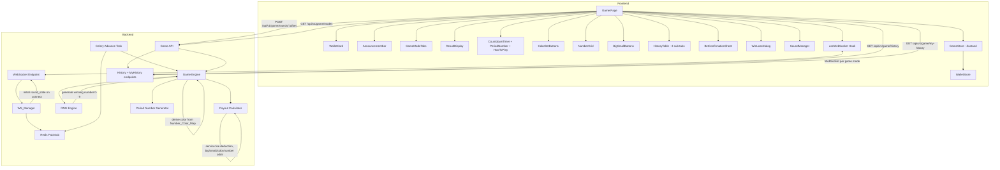

# Design Document: 51game WinGo UX Overhaul

## Overview

This design covers a comprehensive UI/UX overhaul of the Color Prediction Game to match the 51game WinGo platform interface. The overhaul spans both backend and frontend across 16 requirements:

**Backend additions:**
1. Big/Small betting mechanics (bet type "big"/"small", payout at 2.0x)
2. Service fee deduction (2% fee on winning payouts)
3. Period number generation (formatted round identifiers: YYYYMMDD + mode_prefix + sequence)
4. Game history API endpoints (paginated `/history` and `/my-history`)
5. Game mode WebSocket switching (active round lookup per mode)

**Frontend additions:**
1. Big/Small betting buttons below the number grid
2. Game mode timer tabs (30s, 1Min, 3Min, 5Min)
3. Period number display replacing UUID round identifiers
4. Bet confirmation bottom sheet (amount presets, quantity, multiplier, agree checkbox)
5. Win/Loss celebration dialog with auto-close countdown
6. Sound effects manager (countdown beeps, bet confirmation, win celebration)
7. Scrolling announcement bar (marquee with speaker icon)
8. "How to Play" rules modal
9. Enhanced game history table with pagination (Game history, Chart, My history tabs)
10. Quick multiplier row (Random, X1–X100)
11. Wallet card at top with Withdraw/Deposit buttons

All changes extend the existing FastAPI backend, React/Next.js frontend, WebSocket real-time updates, and Zustand state management — nothing is replaced.

## Architecture



### Key Architectural Decisions

1. **Big/Small bets reuse the existing `Bet.color` field** — Values "big" and "small" are stored in the same `color` column (String(20)), alongside existing color names and digit strings. This avoids schema migration and keeps the bet placement API unchanged. The payout calculator distinguishes bet types by checking the value.

2. **Service fee is applied at payout time, not bet placement** — The full bet amount is deducted from the player's wallet when placing a bet. The 2% fee is deducted only when calculating winning payouts: `payout = (bet_amount × 0.98) × odds`. This keeps bet placement simple and the fee transparent.

3. **Period numbers are generated server-side** — A new `period_number` field on `GameRound` stores the formatted identifier. The sequence counter is scoped per game mode per UTC date, using a database sequence or atomic counter in Redis. The format is `YYYYMMDD` + 3-digit mode prefix + 7-digit zero-padded sequence.

4. **Game mode switching disconnects/reconnects WebSocket** — When the player switches game mode tabs, the frontend disconnects from the current round's WebSocket and connects to the new mode's active round. The backend provides the active round ID per mode via the existing `/api/v1/game/modes` endpoint (extended with `active_round_id`).

5. **Bet confirmation bottom sheet replaces direct bet placement** — Tapping any betting button (color, number, big, small) opens a bottom sheet instead of placing the bet immediately. The sheet allows configuring amount, quantity, and multiplier before confirming.

6. **Sound effects use the Web Audio API with user interaction gate** — Sounds are only played after the first user interaction (click/tap/keypress) to comply with browser autoplay policies. Mute preference is persisted in localStorage.

7. **History table uses server-side pagination** — Two new API endpoints (`/history` and `/my-history`) return paginated data. The frontend fetches pages on demand rather than loading all history into the Zustand store.

## Components and Interfaces

### Backend Components

#### 1. Updated `GameRound` Model
- **Location**: `app/models/game.py`
- **Changes**:
  - Add `period_number: Mapped[Optional[str]] = mapped_column(String(20), unique=True, nullable=True, index=True)`
  - Existing `winning_number` and `winning_color` fields are unchanged

#### 2. Updated `GameMode` Model — Extended `odds` JSON
- **Location**: `app/models/game.py`
- **Changes**: The `odds` JSON column is extended to include big/small odds:
  ```json
  {
    "green": "2.0", "red": "2.0", "violet": "4.8",
    "number": "9.6", "big": "2.0", "small": "2.0"
  }
  ```

#### 3. Updated `Game_Engine.place_bet()` — Big/Small Validation
- **Location**: `app/services/game_engine.py`
- **Changes**: Extend the valid bet choices to include "big" and "small" alongside existing color names and digit strings. Look up odds from `game_mode.odds["big"]` or `game_mode.odds["small"]`.

#### 4. Updated `Payout_Calculator` — Service Fee + Big/Small
- **Location**: `app/services/payout_calculator.py`
- **Changes**:
  - Add `SERVICE_FEE_RATE` configurable constant (default `Decimal("0.02")`)
  - Modify `calculate_payout()` to apply service fee: `payout = (bet_amount × (1 - SERVICE_FEE_RATE)) × odds`
  - Add big/small bet resolution: "big" wins when `winning_number >= 5`, "small" wins when `winning_number <= 4`
  - Add `_is_big_small_bet()` and `_is_big_small_winner()` helper functions

#### 5. Period Number Generator
- **Location**: `app/services/period_number.py` (new file)
- **Functions**:
  ```python
  async def generate_period_number(session: AsyncSession, game_mode_id: UUID, mode_prefix: str) -> str:
      """Generate YYYYMMDD + mode_prefix(3) + sequence(7) period number."""
  
  def format_period_number(date_str: str, mode_prefix: str, sequence: int) -> str:
      """Format components into a period number string."""
  
  def parse_period_number(period_number: str) -> tuple[str, str, int]:
      """Parse a period number into (date_str, mode_prefix, sequence)."""
  ```
- **Sequence strategy**: Use a database table `period_sequences` with composite key `(game_mode_id, date_str)` and an atomic increment. Alternatively, use Redis `INCR` on key `period_seq:{mode_id}:{YYYYMMDD}` with TTL of 48 hours.

#### 6. Updated `Game_Engine.start_round()` — Period Number
- **Location**: `app/services/game_engine.py`
- **Changes**: After creating the `GameRound`, generate and assign `period_number` using the period number generator. The `GameMode` model needs a `mode_prefix` field (or derive it from a config mapping).

#### 7. Game History API Endpoints
- **Location**: `app/api/game.py`
- **New endpoints**:
  ```python
  @router.get("/history")
  async def get_game_history(page: int = 1, size: int = 10, mode_id: UUID | None = None, db=Depends(get_db)):
      """Paginated completed rounds with period_number, winning_number, winning_color, big_small_label."""
  
  @router.get("/my-history")
  async def get_my_history(page: int = 1, size: int = 10, db=Depends(get_db), player_id=Depends(get_current_player_id)):
      """Paginated player bets with period_number, bet_type, amount, outcome, payout."""
  ```

#### 8. Updated `GameMode` Model — Mode Prefix
- **Location**: `app/models/game.py`
- **Changes**: Add `mode_prefix: Mapped[str] = mapped_column(String(3), nullable=False, default="100")` for period number generation.

#### 9. Updated WebSocket Messages
- **Changes to `round_state` and `new_round` messages**: Include `period_number` field.
- **Changes to `_publish_round_state()` in Celery tasks**: Include `period_number` in all phase payloads.

#### 10. Updated `Game_Engine.get_round_state()` — Period Number
- **Location**: `app/services/game_engine.py`
- **Changes**: Add `period_number: Optional[str]` to `RoundState` dataclass and populate it from the `GameRound`.

#### 11. Active Round Lookup per Game Mode
- **Location**: `app/services/game_engine.py` or `app/api/game.py`
- **New function**:
  ```python
  async def get_active_round_for_mode(session: AsyncSession, game_mode_id: UUID) -> GameRound | None:
      """Return the current BETTING or RESOLUTION round for a game mode."""
  ```
- The `/api/v1/game/modes` response is extended with `active_round_id` so the frontend knows which round to connect to when switching modes.

### Frontend Components

#### 1. `WalletCard` Component (new)
- **Location**: `frontend/src/components/WalletCard.tsx`
- **Props**: None (reads from `useWalletStore`)
- **Renders**: Card with wallet icon, balance display (₹ symbol), "Withdraw" and "Deposit" buttons
- **Behavior**: Buttons navigate to `/wallet` page. Balance updates in real-time from wallet store.

#### 2. `AnnouncementBar` Component (new)
- **Location**: `frontend/src/components/AnnouncementBar.tsx`
- **Props**: `text: string`, `onDetailClick?: () => void`
- **Renders**: Horizontal marquee with speaker icon on left, scrolling text, "Detail" button on right
- **Animation**: CSS `@keyframes marquee` for continuous right-to-left scroll

#### 3. `GameModeTabs` Component (new)
- **Location**: `frontend/src/components/GameModeTabs.tsx`
- **Props**: `modes: GameMode[]`, `activeMode: string`, `onModeChange: (modeId: string) => void`
- **Renders**: Horizontal tab bar with labels "Win Go 30s", "Win Go 1Min", etc.
- **Behavior**: Active tab has distinct background. Tapping inactive tab triggers `onModeChange`.

#### 4. `BigSmallButtons` Component (new)
- **Location**: `frontend/src/components/BigSmallButtons.tsx`
- **Props**: `onSelectBigSmall: (type: 'big' | 'small') => void`, `disabled: boolean`, `placedBigSmall?: Set<string>`
- **Renders**: Two horizontal buttons — "Big 5-9 x2.0" and "Small 0-4 x2.0"
- **Behavior**: Disabled during non-betting phases. Badge indicator when bet placed. Tapping opens BetConfirmationSheet.

#### 5. `BetConfirmationSheet` Component (new)
- **Location**: `frontend/src/components/BetConfirmationSheet.tsx`
- **Props**:
  ```typescript
  interface BetConfirmationSheetProps {
    isOpen: boolean;
    betType: string; // "green", "red", "violet", "0"-"9", "big", "small"
    gameModeName: string;
    balance: string;
    onConfirm: (amount: number, quantity: number) => void;
    onCancel: () => void;
  }
  ```
- **Internal state**: `selectedPreset` (₹1/₹10/₹100/₹1000), `quantity` (1–100), `multiplier` (X1–X100), `agreedToRules` (boolean)
- **Renders**: Bottom sheet overlay with:
  - Header: game mode name + bet type
  - Balance preset buttons (₹1, ₹10, ₹100, ₹1000)
  - Quantity controls (−, input, +)
  - Quick multiplier row (Random, X1, X5, X10, X20, X50, X100)
  - "I agree with the pre-sale rules" checkbox
  - Footer: Cancel button + Confirm button showing "Total amount ₹X.XX"
- **Validation**: Total = selectedPreset × quantity. Confirm disabled until checkbox checked. Error if total > balance.

#### 6. `WinLossDialog` Component (new)
- **Location**: `frontend/src/components/WinLossDialog.tsx`
- **Props**:
  ```typescript
  interface WinLossDialogProps {
    isOpen: boolean;
    isWin: boolean;
    winningNumber: number;
    winningColor: string;
    isBig: boolean;
    totalBonus: string;
    periodNumber: string;
    onClose: () => void;
  }
  ```
- **Renders**: Centered modal with:
  - "Congratulations" (gold/green) or "Sorry" (muted/gray) header
  - Lottery result: winning number with color indicator + "Big"/"Small" label
  - Total bonus amount with currency symbol
  - Period number
  - 3-second auto-close countdown
  - Close button (X)
- **Behavior**: Auto-closes after 3 seconds. Close button dismisses immediately.

#### 7. `SoundManager` Service (new)
- **Location**: `frontend/src/lib/sound-manager.ts`
- **Interface**:
  ```typescript
  class SoundManager {
    private audioContext: AudioContext | null;
    private isMuted: boolean;
    private hasInteracted: boolean;
    
    initialize(): void; // Called on first user interaction
    playTick(): void;
    playLastSecond(): void;
    playBetConfirm(): void;
    playWinCelebration(): void;
    setMuted(muted: boolean): void;
    isMuted(): boolean;
  }
  ```
- **Storage**: Mute preference in `localStorage` key `sound_muted`
- **Autoplay compliance**: All `play*` methods are no-ops until `initialize()` is called after first user interaction

#### 8. `SoundToggle` Component (new)
- **Location**: `frontend/src/components/SoundToggle.tsx`
- **Renders**: Speaker icon button (🔊/🔇) in the header area
- **Behavior**: Toggles mute/unmute via SoundManager

#### 9. `RulesModal` Component (new)
- **Location**: `frontend/src/components/RulesModal.tsx`
- **Props**: `isOpen: boolean`, `onClose: () => void`
- **Renders**: Centered modal explaining:
  - Color bet payouts: Green 2x, Red 2x, Violet 4.8x
  - Number bet payouts: matching number 9.6x
  - Big/Small bet payouts: Big (5–9) 2x, Small (0–4) 2x
  - 2% service fee on winning payouts
  - Close button at bottom

#### 10. `HistoryTable` Component (new, replaces `HistoryTabs`)
- **Location**: `frontend/src/components/HistoryTable.tsx`
- **Props**: `gameModeId: string`
- **Sub-tabs**: "Game history", "Chart", "My history"
- **Game history tab**: Paginated table with columns: Period, Number (color-coded), Big/Small, Color (dots). 10 rows/page with pagination controls.
- **My history tab**: Paginated table with columns: Period, bet type, amount, outcome, payout.
- **Chart tab**: Placeholder or basic trend indicator (optional for initial release).
- **Data fetching**: Uses `GET /api/v1/game/history?page=X&size=10&mode_id=Y` and `GET /api/v1/game/my-history?page=X&size=10`.

#### 11. Updated `GameModeTabs` + WebSocket Switching
- When mode changes, the game page:
  1. Disconnects current WebSocket
  2. Fetches active round ID for new mode from `/api/v1/game/modes` response
  3. Connects WebSocket to new round
  4. Resets game store state

#### 12. Updated Game Page Layout
- **Location**: `frontend/src/app/game/page.tsx`
- **New layout order** (top to bottom):
  1. WalletCard
  2. AnnouncementBar
  3. GameModeTabs
  4. Timer area (PeriodNumber + CountdownTimer + HowToPlay button + SoundToggle)
  5. ResultDisplay
  6. ColorBetButtons
  7. NumberGrid
  8. BigSmallButtons
  9. HistoryTable
  10. BetConfirmationSheet (overlay)
  11. WinLossDialog (overlay)

#### 13. Updated Game Store
- **Location**: `frontend/src/stores/game-store.ts`
- **New fields**:
  ```typescript
  periodNumber: string | null;        // Current round's period number
  activeGameModeId: string | null;    // Currently selected game mode
  gameModes: GameMode[];              // Fetched from /api/v1/game/modes
  showBetSheet: boolean;              // BetConfirmationSheet visibility
  betSheetType: string | null;        // Which bet type the sheet is for
  showWinLossDialog: boolean;         // WinLossDialog visibility
  ```
- **New actions**:
  ```typescript
  setActiveGameMode: (modeId: string) => void;
  setGameModes: (modes: GameMode[]) => void;
  setPeriodNumber: (pn: string) => void;
  openBetSheet: (betType: string) => void;
  closeBetSheet: () => void;
  openWinLossDialog: () => void;
  closeWinLossDialog: () => void;
  ```

#### 14. Updated `useWebSocket` Hook
- **Location**: `frontend/src/hooks/useWebSocket.ts`
- **Changes**:
  - Accept `roundId` as parameter (already does)
  - Handle `period_number` in `round_state` and `new_round` messages
  - When result arrives and player had bets, trigger `openWinLossDialog()`

## Data Models

### Database Schema Changes

#### `GameRound` — Add `period_number` column
```sql
ALTER TABLE game_rounds ADD COLUMN period_number VARCHAR(20) UNIQUE;
CREATE INDEX idx_game_rounds_period_number ON game_rounds(period_number);
```

SQLAlchemy addition:
```python
period_number: Mapped[Optional[str]] = mapped_column(String(20), unique=True, nullable=True, index=True)
```

#### `GameMode` — Add `mode_prefix` column
```sql
ALTER TABLE game_modes ADD COLUMN mode_prefix VARCHAR(3) NOT NULL DEFAULT '100';
```

SQLAlchemy addition:
```python
mode_prefix: Mapped[str] = mapped_column(String(3), nullable=False, default="100")
```

#### `GameMode.odds` — Extended JSON structure
```json
{
  "green": "2.0",
  "red": "2.0",
  "violet": "4.8",
  "number": "9.6",
  "big": "2.0",
  "small": "2.0"
}
```

#### `PeriodSequence` — New table for sequence tracking
```sql
CREATE TABLE period_sequences (
    id UUID PRIMARY KEY DEFAULT gen_random_uuid(),
    game_mode_id UUID NOT NULL REFERENCES game_modes(id),
    date_str VARCHAR(8) NOT NULL,  -- YYYYMMDD
    last_sequence INTEGER NOT NULL DEFAULT 0,
    UNIQUE(game_mode_id, date_str)
);
```

SQLAlchemy model:
```python
class PeriodSequence(Base):
    __tablename__ = "period_sequences"
    id: Mapped[UUID] = mapped_column(primary_key=True, default=uuid4)
    game_mode_id: Mapped[UUID] = mapped_column(ForeignKey("game_modes.id"), nullable=False)
    date_str: Mapped[str] = mapped_column(String(8), nullable=False)
    last_sequence: Mapped[int] = mapped_column(default=0)
    __table_args__ = (UniqueConstraint("game_mode_id", "date_str"),)
```

### Frontend State Models

#### Extended `RoundState` type
```typescript
interface RoundState {
  roundId: string;
  phase: RoundPhase;
  timer: number;
  totalPlayers: number;
  totalPool: string;
  gameMode: string;
  periodNumber?: string;       // NEW
  activeRoundId?: string;      // NEW — for mode switching
}
```

#### Extended `WSIncomingMessage` — round_state variant
```typescript
{ type: 'round_state'; phase: RoundPhase; timer: number; round_id: string;
  total_players: number; total_pool: string; period_number?: string }
```

#### Extended `WSIncomingMessage` — new_round variant
```typescript
{ type: 'new_round'; round_id: string; timer: number; period_number?: string }
```

#### Extended `GameMode` type
```typescript
interface GameMode {
  // ... existing fields ...
  mode_prefix: string;          // NEW: "100", "101", etc.
  active_round_id?: string;     // NEW: current active round for this mode
}
```

#### Game History Response Types
```typescript
interface GameHistoryEntry {
  period_number: string;
  winning_number: number;
  winning_color: string;
  big_small_label: 'Big' | 'Small';
  completed_at: string;
}

interface MyHistoryEntry {
  period_number: string;
  bet_type: string;
  bet_amount: string;
  is_winner: boolean;
  payout_amount: string;
  created_at: string;
}

interface PaginatedResponse<T> {
  items: T[];
  total: number;
  page: number;
  size: number;
  has_more: boolean;
}
```

### Payout Calculation with Service Fee

```
effective_amount = bet_amount × (1 - SERVICE_FEE_RATE)
payout = effective_amount × odds
```

Where `SERVICE_FEE_RATE = 0.02` (configurable).

Example: ₹100 bet on green, green wins at 2.0x:
- Effective amount: ₹100 × 0.98 = ₹98.00
- Payout: ₹98.00 × 2.0 = ₹196.00

### Big/Small Resolution Logic

```python
BIG_NUMBERS: set[int] = {5, 6, 7, 8, 9}
SMALL_NUMBERS: set[int] = {0, 1, 2, 3, 4}

def _is_big_small_winner(bet_type: str, winning_number: int) -> bool:
    if bet_type == "big":
        return winning_number in BIG_NUMBERS
    if bet_type == "small":
        return winning_number in SMALL_NUMBERS
    return False
```

### Period Number Format

```
YYYYMMDD + mode_prefix(3) + sequence(7, zero-padded)
Example: 20250429 + 100 + 0051058 = "20250429100051058"
```

- `YYYYMMDD`: UTC date when the round was created
- `mode_prefix`: 3-digit prefix assigned to each game mode (100=30s, 101=1Min, 102=3Min, 103=5Min)
- `sequence`: 7-digit zero-padded auto-incrementing number, resets daily per mode

