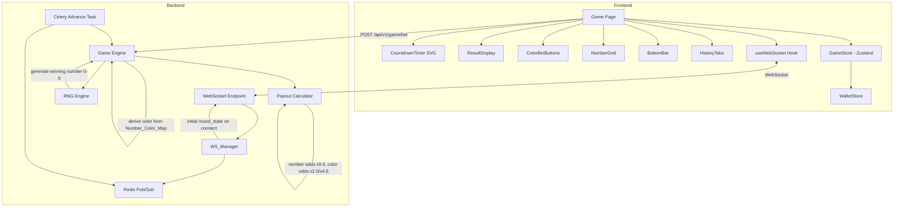

# Design Document: Casino UI Redesign

## Overview

This design covers three interconnected changes to the Color Prediction Game platform:

1. **Casino-Style UI Redesign** — Replace the current generic Tailwind game view with a polished casino-style dark-themed interface featuring a result display, circular SVG countdown timer, Green/Violet/Red color betting buttons, a 0–9 number grid, a persistent bottom bar with balance/win/bet controls, and collapsible History/My Bets tabs.

2. **Number Betting Backend Support** — Extend the existing color-only betting system to accept number bets (0–9). The RNG engine generates a winning number, derives the winning color via `Number_Color_Map`, and the payout calculator handles number-specific odds (x9.6).

3. **Single-Player Bug Fix** — Fix WebSocket state initialization so a player connecting to a round immediately receives the current round state, and ensure the game store renders correctly with `totalPlayers: 1`.

All three changes share the same game page, store, and backend services, so they are designed together to avoid conflicting modifications.

## Architecture

The system follows the existing architecture with targeted modifications at each layer:



### Key Architectural Decisions

1. **Number bets reuse the existing `Bet.color` field** — Number values ("0"–"9") are stored in the same `color` column (String(20)). This avoids a schema migration adding a new column and keeps the bet placement API unchanged. The payout calculator distinguishes number bets from color bets by checking if the value is a digit string.

2. **Winning number is the source of truth** — A new `winning_number` field (Integer, 0–9, nullable) is added to `GameRound`. The RNG engine generates a number 0–9, and the winning color is derived from `Number_Color_Map`. This ensures color bets and number bets resolve from the same RNG outcome.

3. **WS_Manager sends initial state on connect** — The `connect` method is modified to push a `round_state` message immediately after accepting the WebSocket, using `Game_Engine.get_round_state()`. This fixes the single-player bug where the UI waited indefinitely for the next periodic broadcast.

4. **Frontend components are split into focused sub-components** — The monolithic game page is decomposed into `ResultDisplay`, `CountdownTimer`, `ColorBetButtons`, `NumberGrid`, `BottomBar`, and `HistoryTabs` components, each reading from the Zustand store.

## Components and Interfaces

### Frontend Components

#### 1. `ResultDisplay` Component
- **Location**: `frontend/src/components/ResultDisplay.tsx`
- **Props**: None (reads from `useGameStore`)
- **Reads**: `result`, `phase` from game store
- **Renders**: Large circular container showing the winning number with color background per `Number_Color_Map`. Shows "Waiting for result" placeholder during betting phase with no prior result.

#### 2. `CountdownTimer` Component
- **Location**: `frontend/src/components/CountdownTimer.tsx`
- **Props**: `totalSeconds: number`, `remainingSeconds: number`
- **Renders**: SVG circle with `stroke-dasharray`/`stroke-dashoffset` for the progress ring. Numeric seconds in center. Hidden during resolution phase, replaced with "Resolving..." animation.
- **Logic**: `progress = remainingSeconds / totalSeconds`, `dashoffset = circumference * (1 - progress)`.

#### 3. `ColorBetButtons` Component
- **Location**: `frontend/src/components/ColorBetButtons.tsx`
- **Props**: `onSelectColor: (color: string) => void`, `disabled: boolean`
- **Renders**: Three horizontal buttons — Green (x2.0), Violet (x4.8), Red (x2.0). Each shows a checkmark badge when a bet has been placed on that color.

#### 4. `NumberGrid` Component
- **Location**: `frontend/src/components/NumberGrid.tsx`
- **Props**: `onSelectNumber: (num: number) => void`, `disabled: boolean`
- **Renders**: 2×5 grid of number buttons (0–9). Each button is color-coded per `Number_Color_Map` and shows "x9.6" multiplier. Badge indicator when bet placed.

#### 5. `BottomBar` Component
- **Location**: `frontend/src/components/BottomBar.tsx`
- **Props**: None (reads from stores)
- **Reads**: `balance` from wallet store, `result` from game store, local `betAmount` state
- **Renders**: Fixed bottom bar with three sections: Balance display, Win display (last round payout or "0.00"), bet amount controls (numeric display, x2, /2, undo last bet, clear all pending bets).

#### 6. `HistoryTabs` Component
- **Location**: `frontend/src/components/HistoryTabs.tsx`
- **Props**: None (reads from game store + local state)
- **Renders**: Tab bar with "History" and "My Bets" tabs. History shows horizontal scrollable row of colored circles for recent results. My Bets shows list of bets with type, amount, odds, outcome. Collapsible panel.

### Updated Game Page
- **Location**: `frontend/src/app/game/page.tsx`
- **Changes**: Replace current layout with dark gradient background, compose the six sub-components in vertical order: ResultDisplay → CountdownTimer → ColorBetButtons → NumberGrid → BottomBar → HistoryTabs.

### Updated Game Store
- **Location**: `frontend/src/stores/game-store.ts`
- **Changes**:
  - Add `lastResult: { winningNumber: number; winningColor: string } | null` to persist previous round result for display.
  - Add `betAmount: string` for the bottom bar bet amount control.
  - Add `roundHistory: Array<{ roundId: string; winningNumber: number; winningColor: string }>` for the History tab.
  - Change `selectedBets` type to `Record<string, string>` (already is) — keys can be color names ("green", "violet", "red") or number strings ("0"–"9").
  - Update `resetRound` to preserve `lastResult` from the previous round's result and not reset it.
  - Update `RoundResult` type to include `winningNumber: number`.

### Updated WebSocket Types
- **Location**: `frontend/src/types/index.ts`
- **Changes**:
  - Add `winning_number: number` to the `result` WSIncomingMessage variant.
  - Add `winning_number?: number` to `RoundResult` interface.

### Backend Changes

#### Updated `WS_Manager.connect()`
- **Location**: `app/services/ws_manager.py`
- **Change**: After `await websocket.accept()`, fetch the current round state via `game_engine.get_round_state()` and send it as an initial `round_state` message to the newly connected player. This requires passing a database session or using a session factory within the connect method.

#### Updated `GameRound` Model
- **Location**: `app/models/game.py`
- **Change**: Add `winning_number: Mapped[Optional[int]]` column (nullable Integer, 0–9).

#### Updated `RNG_Engine.generate_outcome()`
- **Location**: `app/services/rng_engine.py`
- **Change**: Generate a winning number 0–9 using `secrets.randbelow(10)`. Derive the winning color from `NUMBER_COLOR_MAP`. Return both `selected_number` and `selected_color` in `RNGResult`. The `color_options` parameter is still accepted for backward compatibility but the number is the primary source.

#### `NUMBER_COLOR_MAP` Constant
- **Location**: `app/services/rng_engine.py`
- **Definition**:
  ```python
  NUMBER_COLOR_MAP: dict[int, str] = {
      0: "violet",  # green+violet (dual)
      1: "green",
      2: "red",
      3: "green",
      4: "red",
      5: "violet",  # green+violet (dual)
      6: "red",
      7: "green",
      8: "red",
      9: "green",
  }
  ```
  Note: Numbers 0 and 5 map to "violet" for color-bet resolution purposes (the higher-odds color). Green bets also win on 0/5 since those numbers are green+violet. The payout calculator handles this dual-win logic.

#### Updated `Payout_Calculator.calculate_round_payouts()`
- **Location**: `app/services/payout_calculator.py`
- **Change**: Accept `winning_number: int` parameter in addition to `winning_color`. For each bet:
  - If `bet.color` is a digit string ("0"–"9"): it's a number bet. Winner if `int(bet.color) == winning_number`. Payout uses number odds (x9.6).
  - If `bet.color` is a color name: it's a color bet. Winner if `bet.color == winning_color`. For green bets, also win if `winning_number in (0, 5)` (since 0/5 are green+violet). Payout uses color odds.

#### Updated `Game_Engine.resolve_round()`
- **Location**: `app/services/game_engine.py`
- **Change**: Store `winning_number` from RNG result on the `GameRound` record. Pass `winning_number` to `finalize_round` and through to the payout calculator.

#### Updated `Game_Engine.finalize_round()`
- **Location**: `app/services/game_engine.py`
- **Change**: Pass `winning_number` to `payout_calculator.calculate_round_payouts()`.

#### Updated Celery Task `_publish_round_state()`
- **Location**: `app/tasks/game_tasks.py`
- **Change**: Include `winning_number` in the result phase payload so the frontend can display it.

#### Updated WebSocket Endpoint
- **Location**: `app/api/websocket.py`
- **Change**: No structural changes needed. The WS_Manager handles the initial state push.

### Number_Color_Map (Frontend)
- **Location**: `frontend/src/lib/number-color-map.ts`
- **Definition**: Mirrors the backend map for UI rendering:
  ```typescript
  export const NUMBER_COLOR_MAP: Record<number, { primary: string; secondary?: string }> = {
    0: { primary: 'green', secondary: 'violet' },
    1: { primary: 'green' },
    2: { primary: 'red' },
    3: { primary: 'green' },
    4: { primary: 'red' },
    5: { primary: 'green', secondary: 'violet' },
    6: { primary: 'red' },
    7: { primary: 'green' },
    8: { primary: 'red' },
    9: { primary: 'green' },
  };
  ```


## Data Models

### Database Schema Changes

#### `GameRound` — Add `winning_number` column

```sql
ALTER TABLE game_rounds ADD COLUMN winning_number INTEGER;
-- CHECK constraint: winning_number >= 0 AND winning_number <= 9
ALTER TABLE game_rounds ADD CONSTRAINT chk_winning_number
  CHECK (winning_number IS NULL OR (winning_number >= 0 AND winning_number <= 9));
```

SQLAlchemy model addition in `app/models/game.py`:
```python
winning_number: Mapped[Optional[int]] = mapped_column(nullable=True)
```

#### `GameMode.odds` — Extended JSON structure

The existing `odds` JSON column stores color odds. It is extended to include number odds:
```json
{
  "green": "2.0",
  "red": "2.0",
  "violet": "4.8",
  "number": "9.6"
}
```
The `"number"` key provides a single odds value for all number bets (0–9).

#### `Bet.color` — No schema change

The existing `color` column (String(20)) stores either a color name ("green", "red", "violet") or a number string ("0"–"9"). No migration needed.

### Frontend State Models

#### Extended `RoundResult`
```typescript
interface RoundResult {
  winningColor: string;
  winningNumber: number;       // NEW: 0–9
  playerPayouts: { betId: string; amount: string; isWinner: boolean }[];
}
```

#### Extended `GameStoreState`
```typescript
interface GameStoreState {
  // ... existing fields ...
  lastResult: { winningNumber: number; winningColor: string } | null;  // NEW
  betAmount: string;           // NEW: controlled by BottomBar
  roundHistory: Array<{        // NEW: for History tab
    roundId: string;
    winningNumber: number;
    winningColor: string;
  }>;
}
```

#### Extended `WSIncomingMessage` — result variant
```typescript
{ type: 'result'; winning_color: string; winning_number: number; payouts: PayoutInfo[] }
```

### Number_Color_Map (Shared Constant)

Backend (`app/services/rng_engine.py`):
```python
NUMBER_COLOR_MAP: dict[int, str] = {
    0: "violet", 1: "green", 2: "red", 3: "green", 4: "red",
    5: "violet", 6: "red", 7: "green", 8: "red", 9: "green",
}

# Numbers that count as "green" winners for color bets
GREEN_WINNING_NUMBERS: set[int] = {0, 1, 3, 5, 7, 9}
# Numbers that count as "red" winners for color bets
RED_WINNING_NUMBERS: set[int] = {2, 4, 6, 8}
# Numbers that count as "violet" winners for color bets
VIOLET_WINNING_NUMBERS: set[int] = {0, 5}
```

Frontend (`frontend/src/lib/number-color-map.ts`):
```typescript
export const NUMBER_COLOR_MAP: Record<number, { primary: string; secondary?: string }> = {
  0: { primary: 'green', secondary: 'violet' },
  1: { primary: 'green' },
  2: { primary: 'red' },
  3: { primary: 'green' },
  4: { primary: 'red' },
  5: { primary: 'green', secondary: 'violet' },
  6: { primary: 'red' },
  7: { primary: 'green' },
  8: { primary: 'red' },
  9: { primary: 'green' },
};
```

### Payout Logic for Dual-Color Numbers (0 and 5)

Numbers 0 and 5 are special: they are both green and violet. When the winning number is 0 or 5:
- **Green color bets** win at x2.0 odds
- **Violet color bets** win at x4.8 odds
- **Number bets on 0 or 5** win at x9.6 odds
- **Red color bets** lose

This means a single round result can pay out both green and violet color bets simultaneously when the winning number is 0 or 5.


## Correctness Properties

*A property is a characteristic or behavior that should hold true across all valid executions of a system — essentially, a formal statement about what the system should do. Properties serve as the bridge between human-readable specifications and machine-verifiable correctness guarantees.*

### Property 1: Number-to-Color mapping consistency

*For any* number `n` in the range 0–9, the `NUMBER_COLOR_MAP[n]` on the backend and the `NUMBER_COLOR_MAP[n]` on the frontend SHALL produce the same color assignment, and the color SHALL be one of "green", "red", or "violet".

**Validates: Requirements 2.2, 5.2, 8.3, 8.5**

### Property 2: Countdown timer progress ring calculation

*For any* `totalSeconds > 0` and `remainingSeconds` where `0 <= remainingSeconds <= totalSeconds`, the SVG stroke-dashoffset SHALL equal `circumference * (1 - remainingSeconds / totalSeconds)`, where `circumference = 2 * π * radius`. When `remainingSeconds = 0`, the dashoffset SHALL equal the full circumference (fully depleted). When `remainingSeconds = totalSeconds`, the dashoffset SHALL be 0 (full ring).

**Validates: Requirements 3.1, 3.3**

### Property 3: Number bet payout correctness

*For any* winning number `w` (0–9) and *for any* number bet with `bet_number` (0–9) and `bet_amount > 0`, the bet is a winner if and only if `bet_number == w`, and the payout amount SHALL equal `bet_amount * number_odds` (quantized to 2 decimal places) for winners, or `0.00` for losers.

**Validates: Requirements 8.4**

### Property 4: Color bet payout correctness with dual-color numbers

*For any* winning number `w` (0–9) and *for any* color bet with `bet_color` in {"green", "red", "violet"} and `bet_amount > 0`:
- If `bet_color == "green"`: the bet is a winner if and only if `w` is in {0, 1, 3, 5, 7, 9}
- If `bet_color == "red"`: the bet is a winner if and only if `w` is in {2, 4, 6, 8}
- If `bet_color == "violet"`: the bet is a winner if and only if `w` is in {0, 5}

And the payout amount SHALL equal `bet_amount * color_odds[bet_color]` (quantized to 2 decimal places) for winners, or `0.00` for losers.

**Validates: Requirements 8.3, 8.4**

### Property 5: Number bet acceptance and validation

*For any* number string `n` in {"0", "1", ..., "9"} and *for any* bet amount `a`, the Game_Engine SHALL accept the bet if and only if `min_bet <= a <= max_bet` and the player has sufficient balance. The bet SHALL be rejected with `BetLimitError` if the amount is outside limits, and with `InsufficientBalanceError` if balance is insufficient.

**Validates: Requirements 8.2**

### Property 6: WebSocket connection count accuracy

*For any* sequence of `connect` and `disconnect` operations on the WS_Manager for a given round, `get_round_connection_count(round_id)` SHALL return the number of currently active (connected and not yet disconnected) unique players for that round.

**Validates: Requirements 10.3**

### Property 7: RNG winning number uniform distribution

*For any* sufficiently large sample of RNG outcomes (N ≥ 1000), the distribution of winning numbers 0–9 SHALL not deviate significantly from uniform (each number appearing approximately N/10 times), as validated by a chi-squared goodness-of-fit test with p > 0.01.

**Validates: Requirements 8.5**

## Error Handling

### Frontend Error Handling

| Scenario | Handling |
|---|---|
| WebSocket disconnects | Show reconnecting banner (existing). Game store preserves `lastResult`. Countdown pauses. |
| WebSocket receives initial `round_state` with unknown phase | Default to betting phase, log warning. |
| Bet placement API returns error | Display inline error on the bet input (existing BettingControls pattern). |
| Bet amount exceeds balance | Client-side validation prevents submission. BottomBar shows balance. |
| Number bet on non-digit value | Frontend only allows 0–9 buttons; no free-text number input. |
| `result` message missing `winning_number` | Fall back to displaying `winning_color` only (backward compatibility). |
| History/My Bets API fails | Show "Failed to load" message in tab content area with retry button. |

### Backend Error Handling

| Scenario | Handling |
|---|---|
| Number bet with invalid digit string (e.g., "10", "abc") | Return 422 validation error. The `color` field must be a valid color name or single digit "0"–"9". |
| `winning_number` is None during finalize | Should never happen (set during resolve). If it does, log error and skip number bet payouts, process color bets only. |
| WS_Manager `connect` fails to fetch round state | Log error, still accept the connection. Player will receive state on next periodic broadcast. |
| Round resolves with zero bets | Finalize with zero payouts (no error). Start new round immediately. |
| Database migration for `winning_number` column | Nullable column, no default needed. Existing rounds have NULL `winning_number`. |

## Testing Strategy

### Unit Tests (Example-Based)

**Frontend:**
- ResultDisplay renders winning number with correct color background
- ResultDisplay shows placeholder when no result exists
- CountdownTimer hides during resolution phase
- ColorBetButtons renders three buttons with correct labels and multipliers
- ColorBetButtons disables during non-betting phases
- NumberGrid renders 10 buttons with correct numbers
- BottomBar displays balance, win amount, and bet controls
- BottomBar win display shows "0.00" when no wins
- HistoryTabs switches between History and My Bets
- Game store `resetRound` preserves `lastResult`
- Game store `setRoundState` works with `totalPlayers: 1`

**Backend:**
- `place_bet` accepts digit strings "0"–"9" as valid color values
- `place_bet` rejects invalid strings like "10" or "abc"
- `resolve_round` sets both `winning_color` and `winning_number`
- `finalize_round` with zero bets produces zero payouts
- WS_Manager `connect` sends initial `round_state` message
- Celery task resolves rounds with single player (no min player check)

### Property-Based Tests

**Library**: Hypothesis (Python backend), fast-check (TypeScript frontend)

**Configuration**: Minimum 100 iterations per property test.

Each property test references its design document property with a tag comment:
`# Feature: casino-ui-redesign, Property {N}: {title}`

**Backend properties to implement:**
1. Property 1 (backend portion): Number_Color_Map returns valid color for all numbers 0–9
2. Property 3: Number bet payout correctness
3. Property 4: Color bet payout with dual-color numbers
4. Property 5: Number bet acceptance and validation
5. Property 6: Connection count accuracy
6. Property 7: RNG uniform distribution

**Frontend properties to implement:**
1. Property 1 (frontend portion): NUMBER_COLOR_MAP consistency with backend
2. Property 2: Countdown timer progress ring calculation

### Integration Tests

- WebSocket connect → receive initial round_state → place bet → receive result (single player end-to-end)
- Number bet placement via API → round resolution → correct payout credited
- Celery task advances round with zero bets → new round starts
- WebSocket reconnection restores game state

