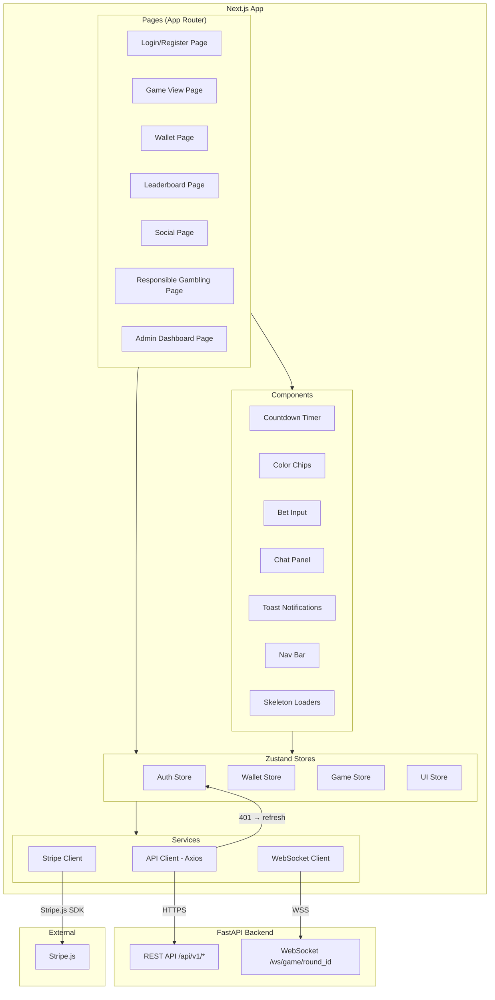
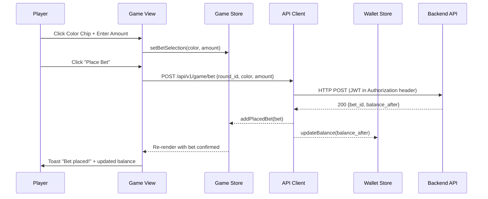
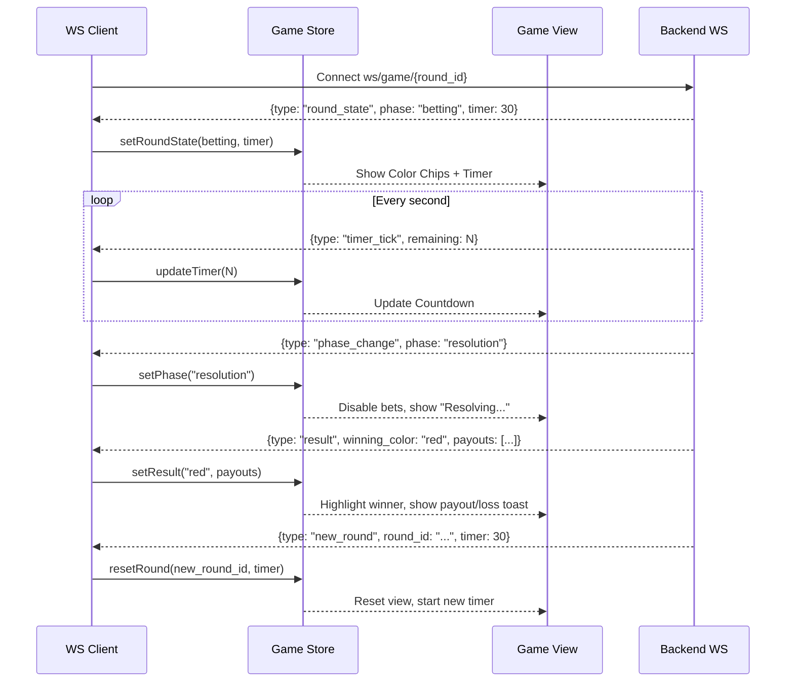
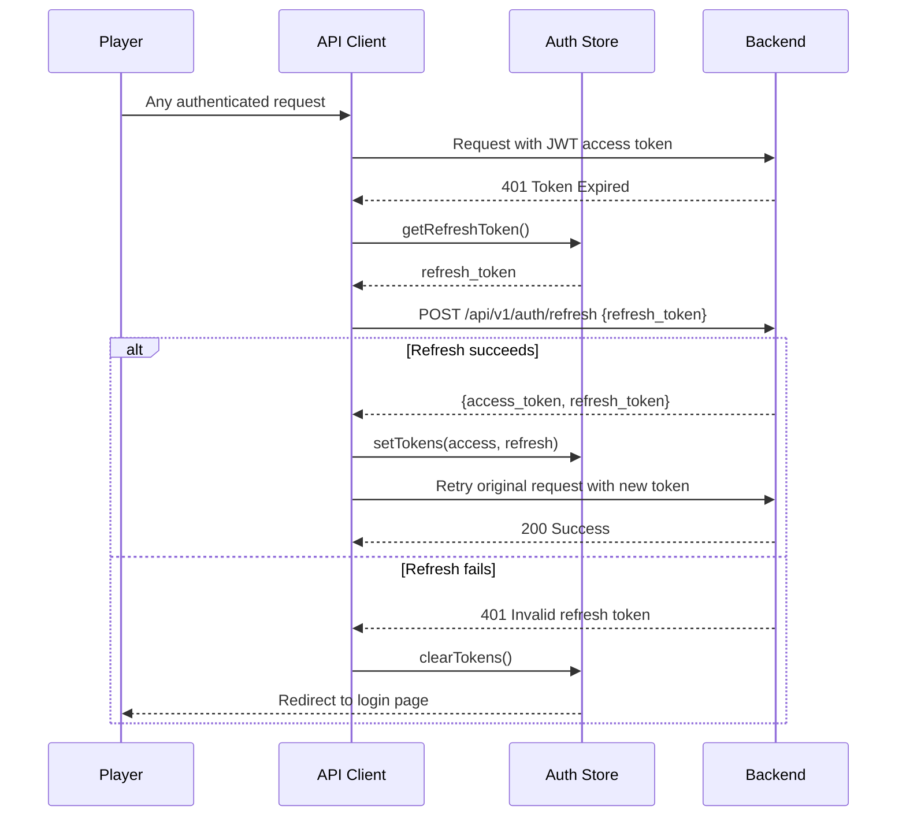

# Design Document: Color Prediction Game Frontend

## Overview

The Color Prediction Game Frontend is a React/Next.js application that provides the user interface for a real-time multiplayer color prediction betting platform. It integrates with an existing Python/FastAPI backend via REST APIs and WebSocket connections.

The frontend architecture follows a layered client-side design:
- **Page Layer**: Next.js App Router pages with server/client component split
- **Component Layer**: Reusable UI components (Game_View, Wallet_Panel, Leaderboard_View, Admin_Dashboard)
- **State Layer**: Zustand stores for auth, wallet, game, and UI state
- **Service Layer**: API client (Axios), WebSocket client, Stripe integration
- **Hook Layer**: Custom React hooks for WebSocket management, auth guards, countdown timers, and real-time data subscriptions

Key design decisions:
- **Next.js App Router** for file-based routing, server components for static content, client components for interactive game UI
- **Zustand** for client-side state management — lightweight, SSR-compatible with per-request store pattern, fine-grained subscriptions for real-time updates
- **Axios** with interceptors for automatic JWT refresh on 401 responses
- **Native WebSocket API** wrapped in a custom hook with exponential backoff reconnection
- **Stripe Elements** (React Stripe.js) for PCI-compliant payment form rendering
- **Tailwind CSS** for responsive styling with dark/light theme support via CSS custom properties

## Architecture

### Frontend Architecture Diagram



### Data Flow: Placing a Bet



### Data Flow: WebSocket Game Round Lifecycle



### Authentication Flow



## Components and Interfaces

### 1. API Client (`lib/api-client.ts`)

Axios instance with JWT interceptors and consistent error handling.

```typescript
interface ApiClient {
  get<T>(url: string, config?: AxiosRequestConfig): Promise<T>;
  post<T>(url: string, data?: unknown, config?: AxiosRequestConfig): Promise<T>;
  put<T>(url: string, data?: unknown, config?: AxiosRequestConfig): Promise<T>;
  delete<T>(url: string, config?: AxiosRequestConfig): Promise<T>;
}
```

Interceptor behavior:
- Request interceptor: attaches `Authorization: Bearer <access_token>` from Auth Store
- Response interceptor: on 401 with `TOKEN_EXPIRED`, queues request, calls `/api/v1/auth/refresh`, retries queued requests with new token. On refresh failure, clears Auth Store and redirects to `/login`.

### 2. WebSocket Client (`lib/ws-client.ts`)

Custom WebSocket wrapper with reconnection and typed message handling.

```typescript
interface WSClient {
  connect(roundId: string, token: string): void;
  disconnect(): void;
  send(message: WSOutgoingMessage): void;
  onMessage(handler: (msg: WSIncomingMessage) => void): () => void;
  getStatus(): 'connecting' | 'connected' | 'disconnected' | 'reconnecting';
}

type WSIncomingMessage =
  | { type: 'round_state'; phase: RoundPhase; timer: number; round_id: string; total_players: number; total_pool: string }
  | { type: 'timer_tick'; remaining: number }
  | { type: 'phase_change'; phase: RoundPhase }
  | { type: 'result'; winning_color: string; payouts: PayoutInfo[] }
  | { type: 'new_round'; round_id: string; timer: number }
  | { type: 'chat_message'; sender: string; message: string; timestamp: string }
  | { type: 'bet_update'; total_players: number; total_pool: string }
  | { type: 'error'; code: string; message: string };

type WSOutgoingMessage =
  | { type: 'chat'; message: string }
  | { type: 'ping' };
```

Reconnection strategy: exponential backoff starting at 1s, doubling to max 30s. Resets on successful connection.

### 3. Auth Store (`stores/auth-store.ts`)

```typescript
interface AuthState {
  accessToken: string | null;
  refreshToken: string | null;
  player: PlayerProfile | null;
  isAuthenticated: boolean;
  isAdmin: boolean;

  setTokens: (access: string, refresh: string) => void;
  clearTokens: () => void;
  setPlayer: (player: PlayerProfile) => void;
  decodeAndSetPlayer: (accessToken: string) => void;
}

interface PlayerProfile {
  id: string;
  email: string;
  username: string;
  isAdmin: boolean;
}
```

Tokens stored in memory (Zustand store) — not localStorage — to prevent XSS token theft. Refresh token sent as httpOnly cookie by backend for persistence across page reloads.

### 4. Wallet Store (`stores/wallet-store.ts`)

```typescript
interface WalletState {
  balance: string | null;  // Decimal string, e.g. "150.00"
  transactions: Transaction[];
  transactionPage: number;
  hasMoreTransactions: boolean;
  isLoading: boolean;

  fetchBalance: () => Promise<void>;
  updateBalance: (newBalance: string) => void;
  fetchTransactions: (page?: number) => Promise<void>;
  deposit: (amount: string, stripeToken: string) => Promise<void>;
  withdraw: (amount: string) => Promise<void>;
}

interface Transaction {
  id: string;
  type: 'deposit' | 'withdrawal' | 'bet_debit' | 'payout_credit';
  amount: string;
  balanceAfter: string;
  description: string | null;
  createdAt: string;
}
```

### 5. Game Store (`stores/game-store.ts`)

```typescript
interface GameState {
  currentRound: RoundState | null;
  phase: RoundPhase;
  timerRemaining: number;
  colorOptions: ColorOption[];
  selectedBets: Map<string, string>;  // color -> amount string
  placedBets: PlacedBet[];
  result: RoundResult | null;
  connectionStatus: 'connecting' | 'connected' | 'disconnected' | 'reconnecting';

  setRoundState: (state: RoundState) => void;
  setPhase: (phase: RoundPhase) => void;
  updateTimer: (remaining: number) => void;
  setBetSelection: (color: string, amount: string) => void;
  removeBetSelection: (color: string) => void;
  addPlacedBet: (bet: PlacedBet) => void;
  setResult: (result: RoundResult) => void;
  resetRound: (roundId: string, timer: number) => void;
  setConnectionStatus: (status: string) => void;
}

type RoundPhase = 'betting' | 'resolution' | 'result';

interface ColorOption {
  color: string;
  odds: string;  // Decimal string
}

interface PlacedBet {
  id: string;
  color: string;
  amount: string;
  oddsAtPlacement: string;
  potentialPayout: string;
}

interface RoundResult {
  winningColor: string;
  playerPayouts: { betId: string; amount: string; isWinner: boolean }[];
}

interface RoundState {
  roundId: string;
  phase: RoundPhase;
  timer: number;
  totalPlayers: number;
  totalPool: string;
  gameMode: string;
}
```

### 6. UI Store (`stores/ui-store.ts`)

```typescript
interface UIState {
  theme: 'light' | 'dark';
  isChatOpen: boolean;
  unreadChatCount: number;
  isOffline: boolean;
  sessionStartTime: number | null;
  sessionLimitMinutes: number | null;

  setTheme: (theme: 'light' | 'dark') => void;
  toggleChat: () => void;
  incrementUnreadChat: () => void;
  resetUnreadChat: () => void;
  setOffline: (offline: boolean) => void;
  startSession: (limitMinutes: number | null) => void;
}
```

### 7. Custom Hooks

| Hook | Signature | Description |
|---|---|---|
| `useWebSocket` | `(roundId: string) => { status, sendMessage }` | Manages WS lifecycle, dispatches messages to Game Store, handles reconnection |
| `useCountdown` | `(initialSeconds: number) => { remaining, isExpired }` | Client-side countdown synced with WS timer ticks |
| `useAuthGuard` | `() => void` | Redirects to `/login` if not authenticated; used in layout components |
| `useAdminGuard` | `() => void` | Redirects to `/game` if user is not admin |
| `useOnlineStatus` | `() => boolean` | Monitors `navigator.onLine` and dispatches to UI Store |
| `useSessionTimer` | `() => { elapsed, limitReached }` | Tracks session duration, triggers warning at limit |
| `useWalletSync` | `() => void` | Listens for bet/payout WS messages and updates Wallet Store balance |

### 8. Page Components

| Page Route | Component | Description |
|---|---|---|
| `/login` | `LoginPage` | Login form with email/password, links to register and forgot password |
| `/register` | `RegisterPage` | Registration form with client-side validation |
| `/forgot-password` | `ForgotPasswordPage` | Email input for password reset request |
| `/reset-password/[token]` | `ResetPasswordPage` | New password form with token from URL |
| `/game` | `GameViewPage` | Main game interface with color chips, betting, timer, results |
| `/game/modes` | `GameModesPage` | Game mode selection with descriptions and rules |
| `/wallet` | `WalletPage` | Balance display, deposit (Stripe), withdrawal, transaction history |
| `/leaderboard` | `LeaderboardPage` | Ranked player list with metric/period filters |
| `/social` | `SocialPage` | Friends list, friend search, invite code entry |
| `/social/profile/[id]` | `ProfilePage` | Public player profile with stats |
| `/settings` | `SettingsPage` | Account settings, theme toggle |
| `/settings/responsible-gambling` | `ResponsibleGamblingPage` | Deposit limits, session limits, self-exclusion |
| `/admin` | `AdminDashboardPage` | Metrics overview, navigation to admin sub-pages |
| `/admin/config` | `AdminConfigPage` | Game mode configuration forms |
| `/admin/players` | `AdminPlayersPage` | Player search, suspend/ban actions |
| `/admin/audit` | `AdminAuditPage` | Audit log viewer with filters |
| `/admin/rng-audit` | `AdminRNGAuditPage` | RNG audit log viewer |


## Data Models

### Client-Side Type Definitions (`types/index.ts`)

All monetary values are represented as strings (decimal strings) to match the backend's fixed-point `Numeric(12,2)` representation and avoid JavaScript floating-point precision issues.

```typescript
// === Auth Types ===
interface LoginRequest {
  email: string;
  password: string;
}

interface RegisterRequest {
  email: string;
  username: string;
  password: string;
}

interface TokenPair {
  access_token: string;
  refresh_token: string;
}

interface PasswordResetRequest {
  email: string;
}

interface PasswordReset {
  token: string;
  new_password: string;
}

// === Wallet Types ===
interface WalletBalance {
  balance: string;  // e.g. "150.00"
}

interface DepositRequest {
  amount: string;
  stripe_token: string;
}

interface WithdrawRequest {
  amount: string;
}

interface Transaction {
  id: string;
  type: 'deposit' | 'withdrawal' | 'bet_debit' | 'payout_credit';
  amount: string;
  balance_after: string;
  description: string | null;
  created_at: string;  // ISO 8601
}

interface PaginatedTransactions {
  items: Transaction[];
  total: number;
  page: number;
  size: number;
  has_more: boolean;
}

// === Game Types ===
interface GameMode {
  id: string;
  name: string;
  mode_type: 'classic' | 'timed_challenge' | 'tournament';
  color_options: string[];
  odds: Record<string, string>;  // color -> odds decimal string
  min_bet: string;
  max_bet: string;
  round_duration_seconds: number;
  is_active: boolean;
}

interface BetRequest {
  round_id: string;
  color: string;
  amount: string;
}

interface BetResponse {
  id: string;
  color: string;
  amount: string;
  odds_at_placement: string;
  balance_after: string;
}

// === Leaderboard Types ===
type LeaderboardMetric = 'total_winnings' | 'win_rate' | 'win_streak';
type LeaderboardPeriod = 'daily' | 'weekly' | 'monthly' | 'all_time';

interface LeaderboardEntry {
  rank: number;
  player_id: string;
  username: string;
  metric_value: string;
}

interface LeaderboardResponse {
  entries: LeaderboardEntry[];
  player_rank: LeaderboardEntry | null;  // Viewing player's own rank
  metric: LeaderboardMetric;
  period: LeaderboardPeriod;
}

// === Social Types ===
interface InviteCode {
  code: string;
  round_id: string;
}

interface PlayerPublicProfile {
  id: string;
  username: string;
  total_games: number;
  win_rate: string;
  leaderboard_rank: number | null;
}

interface FriendRequest {
  username: string;
}

// === Responsible Gambling Types ===
type LimitPeriod = 'daily' | 'weekly' | 'monthly';

interface DepositLimit {
  period: LimitPeriod;
  amount: string;
  current_usage: string;
  resets_at: string;  // ISO 8601
}

interface SessionLimitRequest {
  duration_minutes: number;
}

interface SelfExclusionRequest {
  duration: '24h' | '7d' | '30d' | 'permanent';
}

// === Admin Types ===
interface AdminDashboardMetrics {
  active_players: number;
  total_bets: string;
  total_payouts: string;
  revenue: string;
  period: string;
}

interface GameConfigUpdate {
  game_mode_id: string;
  min_bet?: string;
  max_bet?: string;
  odds?: Record<string, string>;
  color_options?: string[];
  round_duration_seconds?: number;
}

interface AdminPlayerEntry {
  id: string;
  email: string;
  username: string;
  is_active: boolean;
  created_at: string;
}

interface AuditLogEntry {
  id: string;
  event_type: string;
  actor_id: string;
  target_id: string | null;
  details: Record<string, unknown>;
  ip_address: string | null;
  created_at: string;
}

interface RNGAuditEntry {
  id: string;
  round_id: string;
  algorithm: string;
  raw_value: number;
  num_options: number;
  selected_color: string;
  created_at: string;
}

// === API Error Types ===
interface ApiError {
  error: {
    code: string;
    message: string;
    details?: Record<string, unknown>;
  };
}
```

### Backend API Endpoint Mapping

| Frontend Action | HTTP Method | Endpoint | Request Body | Response |
|---|---|---|---|---|
| Register | POST | `/api/v1/auth/register` | `RegisterRequest` | `{ message: string }` |
| Login | POST | `/api/v1/auth/login` | `LoginRequest` | `TokenPair` |
| Refresh Token | POST | `/api/v1/auth/refresh` | `{ refresh_token }` | `TokenPair` |
| Password Reset Request | POST | `/api/v1/auth/password-reset-request` | `PasswordResetRequest` | `{ message: string }` |
| Password Reset | POST | `/api/v1/auth/password-reset` | `PasswordReset` | `{ message: string }` |
| Get Balance | GET | `/api/v1/wallet/balance` | — | `WalletBalance` |
| Deposit | POST | `/api/v1/wallet/deposit` | `DepositRequest` | `{ balance: string }` |
| Withdraw | POST | `/api/v1/wallet/withdraw` | `WithdrawRequest` | `{ transaction_id: string }` |
| Get Transactions | GET | `/api/v1/wallet/transactions?page=N&size=M` | — | `PaginatedTransactions` |
| Place Bet | POST | `/api/v1/game/bet` | `BetRequest` | `BetResponse` |
| Get Game Modes | GET | `/api/v1/game/modes` | — | `GameMode[]` |
| Get Leaderboard | GET | `/api/v1/leaderboard/{metric}?period=P` | — | `LeaderboardResponse` |
| Join Private Round | POST | `/api/v1/social/join` | `{ code: string }` | `{ round_id: string }` |
| Send Friend Request | POST | `/api/v1/social/friends` | `FriendRequest` | `{ message: string }` |
| Get Player Profile | GET | `/api/v1/social/profile/{player_id}` | — | `PlayerPublicProfile` |
| Get Deposit Limits | GET | `/api/v1/responsible-gambling/deposit-limit` | — | `DepositLimit[]` |
| Set Deposit Limit | POST | `/api/v1/responsible-gambling/deposit-limit` | `{ period, amount }` | `DepositLimit` |
| Set Session Limit | POST | `/api/v1/responsible-gambling/session-limit` | `SessionLimitRequest` | `{ message: string }` |
| Self-Exclude | POST | `/api/v1/responsible-gambling/self-exclude` | `SelfExclusionRequest` | `{ message: string }` |
| Admin Dashboard | GET | `/api/v1/admin/dashboard?period=P` | — | `AdminDashboardMetrics` |
| Admin Game Config | GET | `/api/v1/admin/game-config` | — | `GameMode[]` |
| Update Game Config | POST | `/api/v1/admin/game-config` | `GameConfigUpdate` | `{ message: string }` |
| Admin Players | GET | `/api/v1/admin/players?search=S&page=N` | — | `PaginatedResponse<AdminPlayerEntry>` |
| Admin Audit Logs | GET | `/api/v1/admin/audit-logs?type=T&from=F&to=T&page=N` | — | `PaginatedResponse<AuditLogEntry>` |
| Admin RNG Audit | GET | `/api/v1/admin/rng-audit?page=N` | — | `PaginatedResponse<RNGAuditEntry>` |

### WebSocket Message Protocol

Connection URL: `wss://{host}/ws/game/{round_id}?token={jwt_access_token}`

Server-to-client messages follow the `WSIncomingMessage` union type defined in the WebSocket Client interface above. Client-to-server messages follow the `WSOutgoingMessage` type.


## Correctness Properties

*A property is a characteristic or behavior that should hold true across all valid executions of a system — essentially, a formal statement about what the system should do. Properties serve as the bridge between human-readable specifications and machine-verifiable correctness guarantees.*

### Property 1: Registration input validation

*For any* string input, the registration validation functions SHALL correctly classify it: email validation accepts only strings matching a valid email pattern, username validation accepts only strings with length between 1 and 50 characters, and password validation accepts only strings meeting the configured complexity rules (minimum length, mixed case, digit, special character). Invalid inputs SHALL produce a validation error message, and valid inputs SHALL pass without error.

**Validates: Requirements 1.1**

### Property 2: Token refresh interceptor

*For any* authenticated API request that receives a 401 response with a `TOKEN_EXPIRED` error code, the API client interceptor SHALL attempt exactly one token refresh call to `/api/v1/auth/refresh` before retrying the original request with the new access token. The retried request SHALL carry the refreshed token in the Authorization header.

**Validates: Requirements 1.4**

### Property 3: Auth route guard

*For any* route path that is configured as an authenticated route, if the Auth Store contains no valid access token, the route guard SHALL redirect to `/login`. If the Auth Store contains a valid access token, the route guard SHALL allow access.

**Validates: Requirements 1.8**

### Property 4: Transaction rendering completeness

*For any* transaction object containing an id, type, amount, balance_after, and created_at, the transaction list renderer SHALL produce output that includes the transaction type label, the formatted amount, and the formatted timestamp. No required field SHALL be omitted from the rendered output.

**Validates: Requirements 2.6**

### Property 5: Betting controls follow game phase

*For any* game round state, betting controls (color chip selection and bet amount input) SHALL be enabled if and only if the current phase is `betting`. When the phase is `resolution` or `result`, all betting controls SHALL be disabled and no bet submission SHALL be possible.

**Validates: Requirements 3.2, 3.4**

### Property 6: Game store reflects WebSocket state updates

*For any* WebSocket message of type `timer_tick` with a `remaining` value, or of type `round_state` with `total_players` and `total_pool` values, the Game Store SHALL update its corresponding fields to exactly match the received values. The timer remaining, total players, and total pool in the store SHALL always equal the most recently received WebSocket values.

**Validates: Requirements 3.3, 3.8**

### Property 7: Game state full reset on new round

*For any* game state (including placed bets, selected bets, result data, and timer), when a `new_round` WebSocket message is received with a new `round_id` and `timer` value, the Game Store SHALL clear all placed bets, clear all selections, clear the previous result, set the phase to `betting`, set the timer to the received value, and set the round ID to the new value. No state from the previous round SHALL persist.

**Validates: Requirements 3.6**

### Property 8: WebSocket reconnection backoff calculation

*For any* reconnection attempt number N (where N ≥ 1), the computed reconnection delay SHALL equal `min(2^(N-1) * 1000, 30000)` milliseconds. The delay SHALL never exceed 30,000 milliseconds and SHALL never be less than 1,000 milliseconds.

**Validates: Requirements 3.7**

### Property 9: API error response parsing

*For any* API error response body conforming to the structure `{ error: { code: string, message: string, details?: object } }`, the error parser SHALL extract the `code` and `message` fields correctly. For any known error code (e.g., `INSUFFICIENT_BALANCE`, `BET_BELOW_MIN`, `BET_ABOVE_MAX`, `BETTING_CLOSED`, `RATE_LIMIT_EXCEEDED`), the parser SHALL map it to the corresponding human-readable display message.

**Validates: Requirements 4.5, 11.1**

### Property 10: Potential payout calculation

*For any* bet amount A (decimal string) and odds multiplier O (decimal string), the computed potential payout SHALL equal the product of A and O, rounded to exactly 2 decimal places using standard rounding. The calculation SHALL use string-based decimal arithmetic (not JavaScript floating-point) to match the backend's fixed-point precision.

**Validates: Requirements 4.8**

### Property 11: Leaderboard entry rendering completeness

*For any* leaderboard entry containing rank, username, and metric_value fields, the leaderboard renderer SHALL produce output that includes all three values. No entry SHALL be rendered with a missing rank, username, or metric value.

**Validates: Requirements 6.1**

### Property 12: Chat message rendering completeness

*For any* incoming chat message containing sender and message fields, the chat panel renderer SHALL produce output that includes both the sender name and the message content. No chat message SHALL be rendered without its sender attribution.

**Validates: Requirements 7.3**

### Property 13: Player profile rendering completeness

*For any* player public profile containing total_games, win_rate, and leaderboard_rank fields, the profile renderer SHALL produce output that includes all three statistics. No statistic SHALL be omitted from the rendered profile.

**Validates: Requirements 7.5**

### Property 14: Session timer notification trigger

*For any* session with a configured time limit of L minutes and a start time T, the session timer SHALL trigger a mandatory reminder notification if and only if the elapsed time (current time - T) is greater than or equal to L minutes. The notification SHALL not trigger before the limit is reached, and SHALL trigger at or after the limit.

**Validates: Requirements 8.5**

### Property 15: Loss warning blocks betting

*For any* game state where a loss threshold warning has been received from the backend and the player has not yet acknowledged the warning, all bet submission actions SHALL be blocked. After the player acknowledges the warning, bet submissions SHALL be permitted again.

**Validates: Requirements 8.7**

### Property 16: Admin route guard

*For any* route path under the `/admin` prefix, if the authenticated user's profile does not have `isAdmin: true`, the admin route guard SHALL redirect to `/game`. If the user has `isAdmin: true`, the guard SHALL allow access.

**Validates: Requirements 9.1**

### Property 17: Validation error field mapping

*For any* API validation error response containing field-level error details (a mapping of field names to error messages), the form error handler SHALL map each field error to the corresponding form input. Every field name present in the error response that has a matching form input SHALL display its error message adjacent to that input.

**Validates: Requirements 11.5**


## Error Handling

### Error Response Parsing

All backend API errors follow a consistent JSON structure:

```json
{
  "error": {
    "code": "INSUFFICIENT_BALANCE",
    "message": "Wallet balance of 50.00 is insufficient for bet of 75.00",
    "details": { "balance": "50.00", "requested": "75.00" }
  }
}
```

The API client's response interceptor parses this structure and dispatches errors to the appropriate handler based on HTTP status code and error code.

### Error Handling Strategy by Category

| HTTP Status | Error Codes | Frontend Behavior |
|---|---|---|
| 401 | `TOKEN_EXPIRED` | Auto-refresh via interceptor, retry original request |
| 401 | `INVALID_CREDENTIALS` | Display "Invalid email or password" on login form |
| 403 | `ACCOUNT_SUSPENDED`, `SELF_EXCLUDED` | Display account status message, disable game actions |
| 422 | `INVALID_PAYLOAD`, `BET_BELOW_MIN`, `BET_ABOVE_MAX` | Map field errors inline adjacent to form inputs |
| 423 | `ACCOUNT_LOCKED` | Display lockout message with remaining duration |
| 429 | `RATE_LIMIT_EXCEEDED` | Display "Too many requests" toast, disable action for Retry-After duration |
| 400 | `INSUFFICIENT_BALANCE` | Display balance and error adjacent to bet/withdrawal input |
| 400 | `BETTING_CLOSED` | Disable betting controls, display phase ended message |
| 400 | `DEPOSIT_LIMIT_EXCEEDED` | Display remaining allowance and reset date |
| 500/503 | `INTERNAL_ERROR` | Display "Something went wrong" with retry button |
| Network Error | — | Display offline banner, queue pending actions |

### WebSocket Error Handling

| Scenario | Behavior |
|---|---|
| Connection refused | Display "Unable to connect" status, retry with backoff |
| Connection dropped mid-round | Display "Reconnecting..." indicator, auto-reconnect with exponential backoff |
| Server sends error message | Display error toast, log to console |
| Invalid message format | Log warning, ignore message, do not crash |
| Auth token expired during WS session | Close WS, refresh token, reconnect with new token |

### Offline Resilience

- Monitor `navigator.onLine` and `online`/`offline` window events
- When offline: display persistent banner, disable actions that require API calls, queue bet submissions
- When back online: dismiss banner, retry queued actions in order, re-establish WebSocket connection
- Pending actions are stored in memory (not persisted) — if the page is refreshed while offline, queued actions are lost

### Form Validation Error Display

- Client-side validation errors display immediately on blur or submit
- API-returned validation errors are mapped to form fields by field name from the `details` object
- If an API error field name doesn't match a form field, display it as a general form error above the form
- Error messages clear when the user modifies the corresponding input

## Testing Strategy

### Property-Based Testing

**Library**: [fast-check](https://fast-check.dev/) (JavaScript/TypeScript PBT library)

**Configuration**: Minimum 100 iterations per property test via `fc.assert(property, { numRuns: 100 })`

Each correctness property from the design document maps to a single fast-check property test. Tests are tagged with comments referencing the design property:

```typescript
// Feature: color-prediction-frontend, Property 10: Potential payout calculation
test('potential payout equals amount * odds with 2 decimal places', () => {
  fc.assert(
    fc.property(
      fc.stringOf(fc.constantFrom('0','1','2','3','4','5','6','7','8','9','.'), { minLength: 3, maxLength: 10 }).filter(s => /^\d+\.\d{2}$/.test(s) && parseFloat(s) > 0),
      fc.stringOf(fc.constantFrom('0','1','2','3','4','5','6','7','8','9','.'), { minLength: 3, maxLength: 6 }).filter(s => /^\d+\.\d{2}$/.test(s) && parseFloat(s) >= 1),
      (amount, odds) => {
        const result = calculatePotentialPayout(amount, odds);
        // Verify using Decimal.js or similar
        const expected = new Decimal(amount).mul(new Decimal(odds)).toFixed(2);
        expect(result).toBe(expected);
      }
    ),
    { numRuns: 100 }
  );
});
```

**Property test files**:
- `__tests__/properties/auth.property.test.ts` — Properties 1, 2, 3
- `__tests__/properties/wallet.property.test.ts` — Property 4
- `__tests__/properties/game.property.test.ts` — Properties 5, 6, 7, 8
- `__tests__/properties/betting.property.test.ts` — Properties 10, 15
- `__tests__/properties/error-handling.property.test.ts` — Properties 9, 17
- `__tests__/properties/leaderboard.property.test.ts` — Property 11
- `__tests__/properties/social.property.test.ts` — Properties 12, 13
- `__tests__/properties/session.property.test.ts` — Property 14
- `__tests__/properties/admin.property.test.ts` — Property 16

### Unit Tests (Example-Based)

Focus on specific scenarios, edge cases, and integration points:

- `__tests__/unit/login-form.test.tsx` — Login submission, error display, redirect on success
- `__tests__/unit/register-form.test.tsx` — Registration submission, success message, email verification prompt
- `__tests__/unit/password-reset.test.tsx` — Forgot password flow, reset form with token
- `__tests__/unit/wallet-panel.test.tsx` — Balance display, deposit with Stripe mock, withdrawal form, insufficient balance error
- `__tests__/unit/game-view.test.tsx` — Color chip selection, bet placement, result display, round transitions
- `__tests__/unit/game-modes.test.tsx` — Mode listing, mode selection, rules display
- `__tests__/unit/leaderboard.test.tsx` — Filter switching, player highlight, scroll to position
- `__tests__/unit/chat-panel.test.tsx` — Message send/receive, unread indicator, panel toggle
- `__tests__/unit/social.test.tsx` — Friend search, invite code, profile display
- `__tests__/unit/responsible-gambling.test.tsx` — Deposit limit forms, session timer, self-exclusion dialog, loss warning modal
- `__tests__/unit/admin-dashboard.test.tsx` — Metrics display, config forms, player management, audit logs
- `__tests__/unit/nav-bar.test.tsx` — Navigation links, balance display, account menu, logout
- `__tests__/unit/toast.test.tsx` — Toast display, auto-dismiss, different toast types
- `__tests__/unit/theme.test.tsx` — Theme toggle, localStorage persistence, CSS variable application

### Integration Tests

- `__tests__/integration/auth-flow.test.tsx` — Full login → token refresh → logout flow with mocked API
- `__tests__/integration/betting-flow.test.tsx` — Select mode → join round → place bet → receive result with mocked WS
- `__tests__/integration/deposit-flow.test.tsx` — Stripe Elements → deposit → balance update with mocked Stripe and API
- `__tests__/integration/websocket-lifecycle.test.tsx` — Connect → receive messages → disconnect → reconnect with mocked WS server
- `__tests__/integration/offline-resilience.test.tsx` — Go offline → queue actions → come online → retry

### Smoke Tests

- `__tests__/smoke/accessibility.test.tsx` — axe-core audit on key pages (game view, wallet, leaderboard)
- `__tests__/smoke/routing.test.tsx` — All routes render without crash, auth guards redirect correctly
- `__tests__/smoke/responsive.test.tsx` — Key pages render at 320px, 768px, and 1920px viewports without overflow
