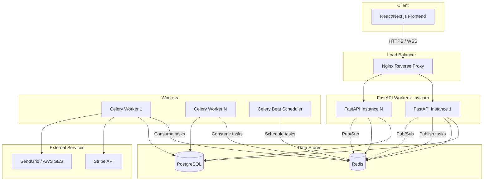
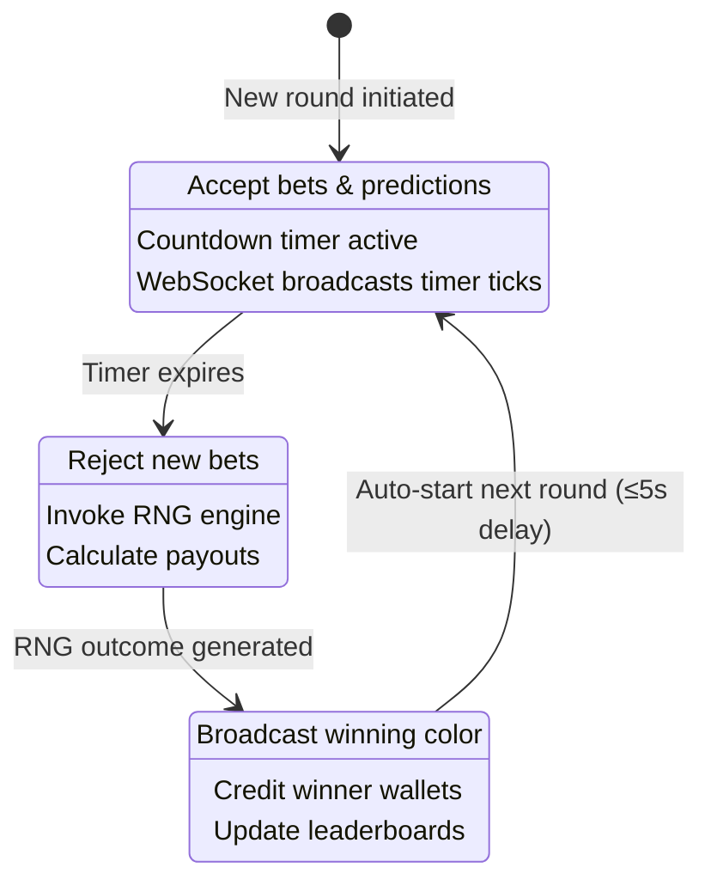
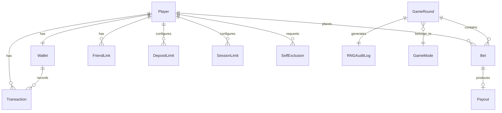

# Design Document: Color Prediction Game

## Overview

The Color Prediction Game is a real-time multiplayer betting platform where players predict which color will be selected by a cryptographically secure RNG engine. The system is built on a Python/FastAPI async backend with a React/Next.js frontend, using WebSockets for real-time communication, PostgreSQL for persistence, Redis for caching/pub-sub, and Celery for background task processing.

The architecture follows a layered design:
- **API Layer**: FastAPI REST endpoints + WebSocket handlers
- **Service Layer**: Business logic (game engine, payout calculator, wallet manager)
- **Data Layer**: SQLAlchemy async ORM models + Redis cache
- **Worker Layer**: Celery tasks for async processing (withdrawals, reports, notifications)

Key design goals:
- Sub-200ms WebSocket delivery for game state updates
- Atomic wallet operations to prevent double-spending
- Provably fair RNG with immutable audit trail
- Horizontal scalability via stateless API servers + Redis pub/sub coordination

## Architecture

### System Architecture Diagram



### Game Round State Machine



### Request Flow

1. **REST API requests**: Client → Nginx (TLS termination) → FastAPI (Pydantic validation → Service layer → SQLAlchemy/Redis) → Response
2. **WebSocket connections**: Client → Nginx → FastAPI WebSocket handler → Redis pub/sub subscription → Real-time broadcasts
3. **Background tasks**: FastAPI enqueues → Redis broker → Celery worker processes → PostgreSQL/External APIs
4. **Game round coordination**: Celery Beat triggers round transitions → Redis pub/sub → All FastAPI instances broadcast to connected clients

## Components and Interfaces

### 1. Authentication Service (`app/services/auth_service.py`)

| Method | Signature | Description |
|---|---|---|
| `register_player` | `(email: str, username: str, password: str) -> Player` | Creates account, hashes password (bcrypt cost 12), sends verification email |
| `authenticate` | `(email: str, password: str) -> TokenPair` | Validates credentials, issues JWT access + refresh tokens |
| `refresh_token` | `(refresh_token: str) -> TokenPair` | Issues new token pair from valid refresh token |
| `request_password_reset` | `(email: str) -> None` | Generates time-limited reset link, sends via email |
| `reset_password` | `(token: str, new_password: str) -> None` | Validates reset token, updates password hash |
| `check_account_lock` | `(player_id: UUID) -> bool` | Returns True if account is locked due to failed attempts |

### 2. Wallet Service (`app/services/wallet_service.py`)

| Method | Signature | Description |
|---|---|---|
| `get_balance` | `(player_id: UUID) -> Decimal` | Returns current wallet balance (Redis cache with DB fallback) |
| `deposit` | `(player_id: UUID, amount: Decimal, stripe_token: str) -> Transaction` | Processes Stripe payment, credits wallet atomically |
| `withdraw` | `(player_id: UUID, amount: Decimal) -> Transaction` | Validates balance, enqueues Celery withdrawal task |
| `debit` | `(player_id: UUID, amount: Decimal, round_id: UUID) -> Transaction` | Deducts bet amount atomically with SELECT FOR UPDATE |
| `credit` | `(player_id: UUID, amount: Decimal, round_id: UUID) -> Transaction` | Credits payout amount atomically |
| `get_transactions` | `(player_id: UUID, page: int, size: int) -> Page[Transaction]` | Returns paginated transaction history, most recent first |

### 3. Game Engine (`app/services/game_engine.py`)

| Method | Signature | Description |
|---|---|---|
| `start_round` | `(game_mode_id: UUID) -> GameRound` | Creates new round, sets state to BETTING_PHASE, starts timer |
| `place_bet` | `(player_id: UUID, round_id: UUID, color: str, amount: Decimal) -> Bet` | Validates phase/limits/balance, deducts wallet, records bet |
| `resolve_round` | `(round_id: UUID) -> GameRound` | Invokes RNG, transitions to RESOLUTION_PHASE |
| `finalize_round` | `(round_id: UUID) -> GameRound` | Calculates payouts, credits wallets, transitions to RESULT_PHASE |
| `get_round_state` | `(round_id: UUID) -> RoundState` | Returns current round state for WebSocket broadcast |

### 4. RNG Engine (`app/services/rng_engine.py`)

| Method | Signature | Description |
|---|---|---|
| `generate_outcome` | `(color_options: list[str]) -> RNGResult` | Uses `secrets.randbelow(len(color_options))` to pick winner |
| `create_audit_entry` | `(round_id: UUID, result: RNGResult) -> AuditLog` | Records algorithm ID, raw value, selected color in append-only log |

### 5. Payout Calculator (`app/services/payout_calculator.py`)

| Method | Signature | Description |
|---|---|---|
| `calculate_payout` | `(bet_amount: Decimal, odds: Decimal) -> Decimal` | Returns `bet_amount * odds`, quantized to 2 decimal places |
| `calculate_round_payouts` | `(round_id: UUID, winning_color: str) -> list[PayoutResult]` | Computes all payouts for a round, flags if exceeds reserve threshold |
| `check_reserve_threshold` | `(total_payout: Decimal) -> bool` | Returns True if total payout exceeds configured reserve limit |

### 6. Leaderboard Service (`app/services/leaderboard_service.py`)

| Method | Signature | Description |
|---|---|---|
| `update_rankings` | `(round_id: UUID) -> None` | Recalculates rankings after round completion |
| `get_leaderboard` | `(metric: str, period: str, page: int) -> LeaderboardPage` | Returns ranked players for given metric/period |
| `get_player_rank` | `(player_id: UUID, metric: str, period: str) -> PlayerRank` | Returns specific player's rank and position |

### 7. WebSocket Manager (`app/services/ws_manager.py`)

| Method | Signature | Description |
|---|---|---|
| `connect` | `(websocket: WebSocket, player_id: UUID, round_id: UUID) -> None` | Registers connection, subscribes to Redis pub/sub channel |
| `disconnect` | `(websocket: WebSocket) -> None` | Removes connection, cleans up subscription |
| `broadcast_round_state` | `(round_id: UUID, state: RoundState) -> None` | Publishes state to Redis, all instances fan out to clients |
| `broadcast_chat` | `(round_id: UUID, message: ChatMessage) -> None` | Routes chat message via Redis pub/sub |
| `send_personal` | `(player_id: UUID, message: dict) -> None` | Sends targeted message to specific player's connection |

### 8. Responsible Gambling Service (`app/services/responsible_gambling_service.py`)

| Method | Signature | Description |
|---|---|---|
| `set_deposit_limit` | `(player_id: UUID, period: str, amount: Decimal) -> DepositLimit` | Sets daily/weekly/monthly deposit cap |
| `check_deposit_limit` | `(player_id: UUID, amount: Decimal) -> LimitCheckResult` | Validates deposit against configured limits |
| `set_session_limit` | `(player_id: UUID, duration_minutes: int) -> None` | Sets session time limit |
| `check_loss_threshold` | `(player_id: UUID) -> bool` | Returns True if 24h cumulative losses exceed threshold |
| `self_exclude` | `(player_id: UUID, duration: str) -> None` | Suspends account for selected duration |

### FastAPI Endpoint Groups

| Route Prefix | Description |
|---|---|
| `POST /api/v1/auth/*` | Registration, login, token refresh, password reset |
| `GET/POST /api/v1/wallet/*` | Balance, deposit, withdraw, transaction history |
| `GET/POST /api/v1/game/*` | Game modes, round state, place bet |
| `GET /api/v1/leaderboard/*` | Leaderboard queries by metric/period |
| `GET/POST /api/v1/social/*` | Friends, invite codes, profiles |
| `GET/POST /api/v1/responsible-gambling/*` | Deposit limits, session limits, self-exclusion |
| `GET/POST /api/v1/admin/*` | Dashboard, config, player management, audit logs, reports |
| `WS /ws/game/{round_id}` | Real-time game updates and chat |


## Data Models

### Entity Relationship Diagram



### SQLAlchemy Models

#### Player

```python
class Player(Base):
    __tablename__ = "players"

    id: Mapped[UUID] = mapped_column(primary_key=True, default=uuid4)
    email: Mapped[str] = mapped_column(String(255), unique=True, nullable=False, index=True)
    username: Mapped[str] = mapped_column(String(50), unique=True, nullable=False, index=True)
    password_hash: Mapped[str] = mapped_column(String(255), nullable=False)
    email_verified: Mapped[bool] = mapped_column(default=False)
    is_active: Mapped[bool] = mapped_column(default=True)
    is_admin: Mapped[bool] = mapped_column(default=False)
    failed_login_attempts: Mapped[int] = mapped_column(default=0)
    locked_until: Mapped[Optional[datetime]] = mapped_column(nullable=True)
    created_at: Mapped[datetime] = mapped_column(default=func.now())
    updated_at: Mapped[datetime] = mapped_column(default=func.now(), onupdate=func.now())
```

#### Wallet

```python
class Wallet(Base):
    __tablename__ = "wallets"

    id: Mapped[UUID] = mapped_column(primary_key=True, default=uuid4)
    player_id: Mapped[UUID] = mapped_column(ForeignKey("players.id"), unique=True, nullable=False)
    balance: Mapped[Decimal] = mapped_column(Numeric(12, 2), default=Decimal("0.00"), nullable=False)
    version: Mapped[int] = mapped_column(default=0)  # Optimistic locking
    created_at: Mapped[datetime] = mapped_column(default=func.now())
    updated_at: Mapped[datetime] = mapped_column(default=func.now(), onupdate=func.now())

    __table_args__ = (
        CheckConstraint("balance >= 0", name="wallet_non_negative_balance"),
    )
```

#### Transaction

```python
class TransactionType(str, Enum):
    DEPOSIT = "deposit"
    WITHDRAWAL = "withdrawal"
    BET_DEBIT = "bet_debit"
    PAYOUT_CREDIT = "payout_credit"

class Transaction(Base):
    __tablename__ = "transactions"

    id: Mapped[UUID] = mapped_column(primary_key=True, default=uuid4)
    wallet_id: Mapped[UUID] = mapped_column(ForeignKey("wallets.id"), nullable=False, index=True)
    player_id: Mapped[UUID] = mapped_column(ForeignKey("players.id"), nullable=False, index=True)
    type: Mapped[TransactionType] = mapped_column(nullable=False)
    amount: Mapped[Decimal] = mapped_column(Numeric(12, 2), nullable=False)
    balance_after: Mapped[Decimal] = mapped_column(Numeric(12, 2), nullable=False)
    reference_id: Mapped[Optional[UUID]] = mapped_column(nullable=True)  # Links to bet/round
    description: Mapped[Optional[str]] = mapped_column(String(255), nullable=True)
    created_at: Mapped[datetime] = mapped_column(default=func.now(), index=True)
```

#### GameMode

```python
class GameMode(Base):
    __tablename__ = "game_modes"

    id: Mapped[UUID] = mapped_column(primary_key=True, default=uuid4)
    name: Mapped[str] = mapped_column(String(50), unique=True, nullable=False)
    mode_type: Mapped[str] = mapped_column(String(20), nullable=False)  # classic, timed_challenge, tournament
    color_options: Mapped[list] = mapped_column(JSON, nullable=False)  # e.g. ["red","green","blue"]
    odds: Mapped[dict] = mapped_column(JSON, nullable=False)  # e.g. {"red": 2.0, "green": 3.0, "blue": 5.0}
    min_bet: Mapped[Decimal] = mapped_column(Numeric(12, 2), nullable=False)
    max_bet: Mapped[Decimal] = mapped_column(Numeric(12, 2), nullable=False)
    round_duration_seconds: Mapped[int] = mapped_column(nullable=False)
    is_active: Mapped[bool] = mapped_column(default=True)
    created_at: Mapped[datetime] = mapped_column(default=func.now())
    updated_at: Mapped[datetime] = mapped_column(default=func.now(), onupdate=func.now())
```

#### GameRound

```python
class RoundPhase(str, Enum):
    BETTING = "betting"
    RESOLUTION = "resolution"
    RESULT = "result"

class GameRound(Base):
    __tablename__ = "game_rounds"

    id: Mapped[UUID] = mapped_column(primary_key=True, default=uuid4)
    game_mode_id: Mapped[UUID] = mapped_column(ForeignKey("game_modes.id"), nullable=False, index=True)
    phase: Mapped[RoundPhase] = mapped_column(nullable=False, default=RoundPhase.BETTING)
    winning_color: Mapped[Optional[str]] = mapped_column(String(20), nullable=True)
    total_bets: Mapped[Decimal] = mapped_column(Numeric(14, 2), default=Decimal("0.00"))
    total_payouts: Mapped[Decimal] = mapped_column(Numeric(14, 2), default=Decimal("0.00"))
    flagged_for_review: Mapped[bool] = mapped_column(default=False)
    betting_ends_at: Mapped[datetime] = mapped_column(nullable=False)
    resolved_at: Mapped[Optional[datetime]] = mapped_column(nullable=True)
    completed_at: Mapped[Optional[datetime]] = mapped_column(nullable=True)
    created_at: Mapped[datetime] = mapped_column(default=func.now())
```

#### Bet

```python
class Bet(Base):
    __tablename__ = "bets"

    id: Mapped[UUID] = mapped_column(primary_key=True, default=uuid4)
    player_id: Mapped[UUID] = mapped_column(ForeignKey("players.id"), nullable=False, index=True)
    round_id: Mapped[UUID] = mapped_column(ForeignKey("game_rounds.id"), nullable=False, index=True)
    color: Mapped[str] = mapped_column(String(20), nullable=False)
    amount: Mapped[Decimal] = mapped_column(Numeric(12, 2), nullable=False)
    odds_at_placement: Mapped[Decimal] = mapped_column(Numeric(6, 2), nullable=False)
    is_winner: Mapped[Optional[bool]] = mapped_column(nullable=True)
    created_at: Mapped[datetime] = mapped_column(default=func.now())

    __table_args__ = (
        CheckConstraint("amount > 0", name="bet_positive_amount"),
    )
```

#### Payout

```python
class Payout(Base):
    __tablename__ = "payouts"

    id: Mapped[UUID] = mapped_column(primary_key=True, default=uuid4)
    bet_id: Mapped[UUID] = mapped_column(ForeignKey("bets.id"), unique=True, nullable=False)
    player_id: Mapped[UUID] = mapped_column(ForeignKey("players.id"), nullable=False, index=True)
    round_id: Mapped[UUID] = mapped_column(ForeignKey("game_rounds.id"), nullable=False, index=True)
    amount: Mapped[Decimal] = mapped_column(Numeric(14, 2), nullable=False)
    credited: Mapped[bool] = mapped_column(default=False)
    created_at: Mapped[datetime] = mapped_column(default=func.now())
```

#### RNGAuditLog

```python
class RNGAuditLog(Base):
    __tablename__ = "rng_audit_logs"

    id: Mapped[UUID] = mapped_column(primary_key=True, default=uuid4)
    round_id: Mapped[UUID] = mapped_column(ForeignKey("game_rounds.id"), unique=True, nullable=False)
    algorithm: Mapped[str] = mapped_column(String(50), nullable=False, default="secrets.randbelow")
    raw_value: Mapped[int] = mapped_column(nullable=False)
    num_options: Mapped[int] = mapped_column(nullable=False)
    selected_color: Mapped[str] = mapped_column(String(20), nullable=False)
    created_at: Mapped[datetime] = mapped_column(default=func.now())
```

#### DepositLimit

```python
class LimitPeriod(str, Enum):
    DAILY = "daily"
    WEEKLY = "weekly"
    MONTHLY = "monthly"

class DepositLimit(Base):
    __tablename__ = "deposit_limits"

    id: Mapped[UUID] = mapped_column(primary_key=True, default=uuid4)
    player_id: Mapped[UUID] = mapped_column(ForeignKey("players.id"), nullable=False, index=True)
    period: Mapped[LimitPeriod] = mapped_column(nullable=False)
    amount: Mapped[Decimal] = mapped_column(Numeric(12, 2), nullable=False)
    current_usage: Mapped[Decimal] = mapped_column(Numeric(12, 2), default=Decimal("0.00"))
    resets_at: Mapped[datetime] = mapped_column(nullable=False)
    created_at: Mapped[datetime] = mapped_column(default=func.now())
    updated_at: Mapped[datetime] = mapped_column(default=func.now(), onupdate=func.now())

    __table_args__ = (
        UniqueConstraint("player_id", "period", name="uq_player_deposit_limit_period"),
    )
```

#### SelfExclusion

```python
class SelfExclusion(Base):
    __tablename__ = "self_exclusions"

    id: Mapped[UUID] = mapped_column(primary_key=True, default=uuid4)
    player_id: Mapped[UUID] = mapped_column(ForeignKey("players.id"), nullable=False, index=True)
    duration: Mapped[str] = mapped_column(String(20), nullable=False)  # 24h, 7d, 30d, permanent
    starts_at: Mapped[datetime] = mapped_column(default=func.now())
    ends_at: Mapped[Optional[datetime]] = mapped_column(nullable=True)  # null for permanent
    is_active: Mapped[bool] = mapped_column(default=True)
    created_at: Mapped[datetime] = mapped_column(default=func.now())
```

#### AuditTrail

```python
class AuditEventType(str, Enum):
    AUTH_LOGIN = "auth_login"
    AUTH_LOGOUT = "auth_logout"
    AUTH_FAILED = "auth_failed"
    WALLET_DEPOSIT = "wallet_deposit"
    WALLET_WITHDRAWAL = "wallet_withdrawal"
    ADMIN_CONFIG_CHANGE = "admin_config_change"
    ADMIN_PLAYER_ACTION = "admin_player_action"
    RESPONSIBLE_GAMBLING = "responsible_gambling"

class AuditTrail(Base):
    __tablename__ = "audit_trail"

    id: Mapped[UUID] = mapped_column(primary_key=True, default=uuid4)
    event_type: Mapped[AuditEventType] = mapped_column(nullable=False, index=True)
    actor_id: Mapped[UUID] = mapped_column(ForeignKey("players.id"), nullable=False, index=True)
    target_id: Mapped[Optional[UUID]] = mapped_column(nullable=True)
    details: Mapped[dict] = mapped_column(JSON, nullable=False)
    ip_address: Mapped[Optional[str]] = mapped_column(String(45), nullable=True)
    created_at: Mapped[datetime] = mapped_column(default=func.now(), index=True)
```

### Redis Data Structures

| Key Pattern | Type | TTL | Purpose |
|---|---|---|---|
| `wallet:{player_id}:balance` | String | 30s | Cached wallet balance |
| `round:{round_id}:state` | Hash | Round duration + 60s | Current round phase, timer, bets count |
| `leaderboard:{metric}:{period}` | Sorted Set | Varies by period | Ranked player scores |
| `player:{player_id}:session` | String | 30min | Session tracking for timeout |
| `player:{player_id}:failed_logins` | String | 15min | Failed login attempt counter |
| `rate_limit:{player_id}` | String | 1min | API rate limit counter |
| `channel:round:{round_id}` | Pub/Sub | — | Real-time round state broadcasts |
| `channel:chat:{round_id}` | Pub/Sub | — | Real-time chat messages |

### Celery Task Definitions

| Task | Queue | Schedule | Description |
|---|---|---|---|
| `process_withdrawal` | `wallet` | On-demand | Processes Stripe payout for withdrawal requests |
| `send_verification_email` | `email` | On-demand | Sends email verification link |
| `send_password_reset_email` | `email` | On-demand | Sends password reset link |
| `send_notification_email` | `email` | On-demand | Sends account lock / gambling warning emails |
| `advance_game_round` | `game` | Periodic (per round timer) | Transitions round phases on timer expiry |
| `update_leaderboards` | `analytics` | On round completion | Recalculates leaderboard rankings |
| `generate_daily_report` | `reports` | Daily at 00:00 UTC | Generates compliance report |
| `reset_deposit_limits` | `maintenance` | Periodic | Resets expired deposit limit counters |
| `cleanup_expired_sessions` | `maintenance` | Every 5 min | Removes expired session data from Redis |


## Correctness Properties

*A property is a characteristic or behavior that should hold true across all valid executions of a system — essentially, a formal statement about what the system should do. Properties serve as the bridge between human-readable specifications and machine-verifiable correctness guarantees.*

### Property 1: Registration input validation

*For any* registration payload, if the email is not a valid email format, or the username is empty/exceeds 50 characters, or the password does not meet complexity rules, the registration SHALL be rejected with a validation error. Conversely, for any payload with a valid email, unique username within length bounds, and a compliant password, registration SHALL succeed.

**Validates: Requirements 1.1**

### Property 2: Password hash round-trip

*For any* randomly generated password string, hashing it with passlib bcrypt (cost factor 12) and then verifying the original password against the hash SHALL return True. Verifying any different password against the same hash SHALL return False.

**Validates: Requirements 1.2, 1.5**

### Property 3: Input validation rejects malicious payloads

*For any* request payload containing SQL injection patterns, XSS script tags, or fields with incorrect types/missing required fields, Pydantic model validation SHALL reject the payload before it reaches the service layer.

**Validates: Requirements 1.7, 12.6**

### Property 4: Withdrawal balance guard

*For any* wallet with balance B and any withdrawal amount A where A > B, the withdrawal SHALL be rejected. For any withdrawal amount A where 0 < A ≤ B, the withdrawal SHALL be accepted and the resulting balance SHALL equal B - A.

**Validates: Requirements 2.3, 2.4**

### Property 5: Transaction record completeness

*For any* wallet operation (deposit, withdrawal, bet debit, payout credit), the resulting Transaction record SHALL contain a non-null unique ID, a timestamp, the operation amount, the transaction type, and a balance_after value that equals the wallet balance immediately after the operation.

**Validates: Requirements 2.5**

### Property 6: Transaction history ordering

*For any* set of transactions belonging to a wallet, the paginated transaction history endpoint SHALL return them sorted by created_at in descending order (most recent first), and each page SHALL contain at most `page_size` entries.

**Validates: Requirements 2.6**

### Property 7: Wallet balance consistency

*For any* sequence of wallet operations (deposits, withdrawals, bet debits, payout credits) applied to a wallet starting at balance 0, the final wallet balance SHALL equal the sum of all credit amounts minus the sum of all debit amounts, and the balance SHALL never be negative at any intermediate step.

**Validates: Requirements 2.7**

### Property 8: Game round state machine validity

*For any* game round, the phase transitions SHALL only follow the sequence BETTING → RESOLUTION → RESULT. Any attempt to transition to a non-successor phase SHALL be rejected. Bets SHALL be accepted only when the round is in BETTING phase; any bet placed during RESOLUTION or RESULT phase SHALL be rejected.

**Validates: Requirements 3.1, 3.2, 3.3, 4.6**

### Property 9: Bet amount within configured limits

*For any* bet amount A and game mode with min_bet M and max_bet X, if A < M or A > X, the bet SHALL be rejected. If M ≤ A ≤ X, the bet SHALL pass the betting limit validation.

**Validates: Requirements 4.2**

### Property 10: Bet rejected when exceeding wallet balance

*For any* player with wallet balance B attempting to place a bet of amount A where A > B, the bet SHALL be rejected with an insufficient balance error, and the wallet balance SHALL remain unchanged.

**Validates: Requirements 4.3**

### Property 11: Wallet debit equals bet amount

*For any* valid bet of amount A placed by a player with wallet balance B (where A ≤ B), after the bet is placed, the player's wallet balance SHALL equal B - A exactly.

**Validates: Requirements 4.4**

### Property 12: RNG uniform distribution

*For any* set of N color options, over a sample of at least 10,000 generated outcomes using `secrets.randbelow(N)`, the frequency of each color option SHALL not deviate from the expected frequency (10000/N) by more than what a chi-squared test at the 99% confidence level would allow.

**Validates: Requirements 5.2**

### Property 13: RNG audit log completeness

*For any* game round that completes the resolution phase, an RNG audit log entry SHALL exist containing the algorithm identifier ("secrets.randbelow"), the raw generated integer value, the number of color options, and the selected winning color. The selected color SHALL equal `color_options[raw_value]`.

**Validates: Requirements 5.3**

### Property 14: RNG outcome independence

*For any* sequence of N consecutive RNG outcomes, the serial correlation coefficient between consecutive outcomes SHALL not be statistically significant (p > 0.01), confirming that each outcome is generated independently of previous outcomes.

**Validates: Requirements 5.4**

### Property 15: Payout calculation correctness

*For any* bet amount A (Decimal) and odds multiplier O (Decimal), the calculated payout SHALL equal `(A * O).quantize(Decimal("0.01"))` using fixed-point Decimal arithmetic. The result SHALL always have exactly two decimal places and SHALL match the equivalent Decimal multiplication (never float multiplication).

**Validates: Requirements 6.1, 6.4**

### Property 16: Reserve threshold flagging

*For any* game round where the sum of all calculated payouts exceeds the configured reserve threshold T, the round SHALL be flagged for admin review (`flagged_for_review = True`). For any round where total payouts ≤ T, the round SHALL NOT be flagged.

**Validates: Requirements 6.5**

### Property 17: Game mode configuration display

*For any* game mode with configured color_options, odds, min_bet, max_bet, and round_duration_seconds, the game mode detail response SHALL contain all of these values matching the stored configuration exactly.

**Validates: Requirements 7.4**

### Property 18: Leaderboard sorting correctness

*For any* set of player statistics and any leaderboard metric (total_winnings, win_rate, win_streak), the leaderboard SHALL return players sorted in descending order by that metric. For any two adjacent entries at positions i and i+1, `entry[i].metric_value >= entry[i+1].metric_value`.

**Validates: Requirements 8.1**

### Property 19: Invite code uniqueness

*For any* N private game rounds created, all N generated invite codes SHALL be distinct (no two rounds share the same invite code).

**Validates: Requirements 9.1**

### Property 20: Deposit limit enforcement

*For any* player with a deposit limit of L for a given period and current usage U, a deposit of amount D SHALL be rejected if U + D > L. The rejection response SHALL include the remaining allowance (L - U) and the limit reset date.

**Validates: Requirements 10.2**

### Property 21: Cumulative loss threshold warning

*For any* player whose cumulative losses within a rolling 24-hour window exceed the configured threshold T, the system SHALL trigger a mandatory warning. For any player whose 24-hour cumulative losses are ≤ T, no warning SHALL be triggered.

**Validates: Requirements 10.6**

### Property 22: Rate limiting enforcement

*For any* player session, if more than 100 API requests are made within a 60-second window, all subsequent requests within that window SHALL be rejected with a 429 status code. Requests within the 100-request limit SHALL be processed normally.

**Validates: Requirements 12.3**

### Property 23: Audit trail creation

*For any* auditable event (authentication attempt, wallet transaction, admin action), an immutable audit trail entry SHALL be created containing the event type, actor ID, timestamp, and event-specific details. The audit trail SHALL be append-only (no updates or deletes).

**Validates: Requirements 12.5**


## Error Handling

### Error Response Format

All API errors follow a consistent JSON structure:

```json
{
  "error": {
    "code": "INSUFFICIENT_BALANCE",
    "message": "Wallet balance of 50.00 is insufficient for bet of 75.00",
    "details": { "balance": "50.00", "requested": "75.00" }
  }
}
```

### Error Categories

| Category | HTTP Status | Error Codes | Handling Strategy |
|---|---|---|---|
| Validation | 422 | `INVALID_PAYLOAD`, `INVALID_EMAIL`, `WEAK_PASSWORD`, `BET_BELOW_MIN`, `BET_ABOVE_MAX` | Pydantic raises `RequestValidationError`, caught by FastAPI exception handler |
| Authentication | 401 / 403 | `INVALID_CREDENTIALS`, `TOKEN_EXPIRED`, `ACCOUNT_LOCKED`, `ACCOUNT_SUSPENDED`, `REAUTH_REQUIRED` | JWT middleware rejects invalid/expired tokens; service layer checks account status |
| Business Logic | 409 / 400 | `INSUFFICIENT_BALANCE`, `BETTING_CLOSED`, `ROUND_NOT_FOUND`, `DEPOSIT_LIMIT_EXCEEDED`, `SELF_EXCLUDED` | Service layer raises domain exceptions, caught by exception handler middleware |
| Rate Limiting | 429 | `RATE_LIMIT_EXCEEDED` | Rate limit middleware returns 429 with `Retry-After` header |
| External Service | 502 / 503 | `STRIPE_ERROR`, `EMAIL_SERVICE_ERROR` | Celery tasks retry with exponential backoff (max 3 retries). Failed payments return 502 to client. |
| Internal | 500 | `INTERNAL_ERROR` | Unhandled exceptions caught by global handler, logged with correlation ID, generic message returned to client |

### Retry and Recovery Strategies

| Scenario | Strategy |
|---|---|
| Stripe payment failure | Celery task retries 3 times with exponential backoff (2s, 4s, 8s). Transaction marked as `failed` after exhaustion. |
| Email delivery failure | Celery task retries 3 times. Failure logged but does not block user flow. |
| Database connection failure | SQLAlchemy connection pool retries. If pool exhausted, return 503 with `Retry-After`. |
| Redis connection failure | Fallback to direct DB queries for wallet balance. WebSocket broadcasts degrade gracefully. |
| WebSocket disconnect | Client auto-reconnects with exponential backoff. Server cleans up stale connections on heartbeat timeout. |

### Database Transaction Error Handling

- All wallet operations use `SELECT ... FOR UPDATE` to prevent concurrent modification
- Optimistic locking via `version` column on Wallet model as secondary guard
- Deadlock detection: SQLAlchemy retries deadlocked transactions up to 3 times
- Constraint violations (e.g., negative balance) caught and translated to domain errors

## Testing Strategy

### Property-Based Testing

**Library**: [Hypothesis](https://hypothesis.readthedocs.io/) (Python PBT library)

**Configuration**: Minimum 100 examples per property test via `@settings(max_examples=100)`

Each correctness property from the design document maps to a single Hypothesis property test. Tests are tagged with comments referencing the design property:

```python
# Feature: color-prediction-game, Property 15: Payout calculation correctness
@given(
    bet_amount=decimals(min_value=Decimal("0.01"), max_value=Decimal("99999.99"), places=2),
    odds=decimals(min_value=Decimal("1.01"), max_value=Decimal("100.00"), places=2),
)
@settings(max_examples=100)
def test_payout_calculation_correctness(bet_amount, odds):
    result = calculate_payout(bet_amount, odds)
    expected = (bet_amount * odds).quantize(Decimal("0.01"))
    assert result == expected
```

**Property test files**:
- `tests/properties/test_wallet_properties.py` — Properties 4, 5, 6, 7, 11
- `tests/properties/test_game_engine_properties.py` — Properties 8, 9, 10
- `tests/properties/test_rng_properties.py` — Properties 12, 13, 14
- `tests/properties/test_payout_properties.py` — Properties 15, 16
- `tests/properties/test_auth_properties.py` — Properties 1, 2, 3
- `tests/properties/test_leaderboard_properties.py` — Property 18
- `tests/properties/test_social_properties.py` — Property 19
- `tests/properties/test_responsible_gambling_properties.py` — Properties 20, 21
- `tests/properties/test_security_properties.py` — Properties 22, 23
- `tests/properties/test_game_mode_properties.py` — Property 17

### Unit Tests (Example-Based)

Focus on specific scenarios, edge cases, and integration points:

- `tests/unit/test_auth_service.py` — Login flow, account locking (3 attempts), password reset, session timeout
- `tests/unit/test_wallet_service.py` — Wallet initialization (zero balance), deposit via Stripe mock
- `tests/unit/test_game_engine.py` — Round lifecycle, RNG invocation during resolution
- `tests/unit/test_game_modes.py` — Classic/Timed/Tournament mode existence and config
- `tests/unit/test_leaderboard.py` — Top 100 limit, player rank inclusion, period filters
- `tests/unit/test_social.py` — Friend add, invite code join, profile display
- `tests/unit/test_responsible_gambling.py` — Deposit limit CRUD, session limit, self-exclusion durations
- `tests/unit/test_admin.py` — Dashboard metrics, config changes, player suspension

### Integration Tests

- `tests/integration/test_websocket.py` — WebSocket connection, round state broadcasts, chat delivery
- `tests/integration/test_stripe.py` — Deposit/withdrawal flow with Stripe test mode
- `tests/integration/test_celery_tasks.py` — Task dispatch and execution for withdrawals, emails, reports
- `tests/integration/test_redis_pubsub.py` — Pub/sub message delivery across simulated multi-instance setup
- `tests/integration/test_db_transactions.py` — Concurrent wallet operations, deadlock handling

### Smoke Tests

- `tests/smoke/test_config.py` — Bcrypt cost factor, CORS policy, TLS config, connection pool settings
- `tests/smoke/test_infrastructure.py` — Redis connectivity, Celery worker health, DB migrations applied
