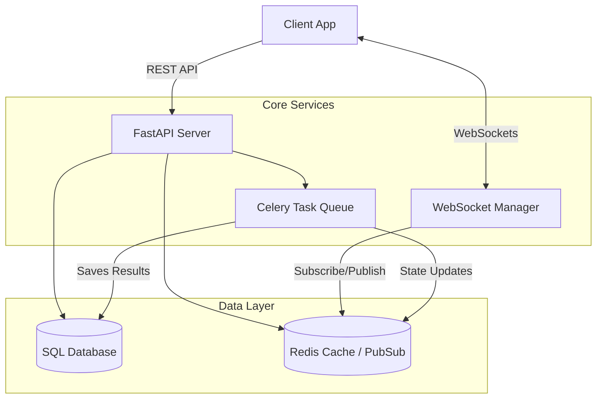
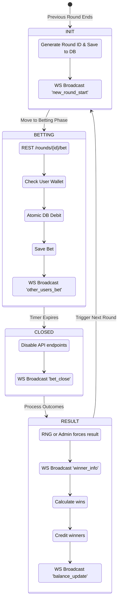

# Color Prediction Game Backend

This is the backend service for the Color Prediction Game platform, built with modern Python technologies to ensure high performance, real-time synchronization, and scalable concurrency.

## Architecture

The backend implements the game architecture with Python's modern async capabilities.



### Tech Stack Mapping (Node.js Plan vs Python Backend)
- **Web Framework**: Node.js + Express $\rightarrow$ **FastAPI**
- **Real-time**: Socket.IO $\rightarrow$ **FastAPI WebSockets + Redis Pub/Sub**
- **Database**: Prisma/Sequelize $\rightarrow$ **SQLAlchemy 2.0 (Async)**
- **Task Queue**: node-cron / BullMQ $\rightarrow$ **Celery**
- **Caching**: Redis $\rightarrow$ **Redis (aioredis)**

## Game Working Flow

The game operates on a continuous, state-machine driven loop managed by Celery background workers. The game states are perfectly synchronized with all connected clients via WebSocket events.



## Running the Application Locally

The project includes a robust local development script that uses `aiosqlite` and `fakeredis` so you do not need external services (like Docker or actual Redis) to test the APIs.

1. **Install dependencies**:
   Ensure you have [uv](https://github.com/astral-sh/uv) installed.
   ```bash
   uv sync --all-extras
   ```
   *Note: This will create a virtual environment and install all dependencies (including dev tools) in `.venv`.*

2. **Start the local server**:
   ```bash
   uv run run_local.py
   ```

3. **Access the API**:
   - The backend runs on `http://localhost:8000`
   - Interactive API Docs (Swagger UI): `http://localhost:8000/api/docs`

## Features Included
- **User Auth**: JWT-based authentication, user roles.
- **Wallet System**: Idempotent balance adjustments.
- **Game Engine**: Atomic bet placements, round state machine, market handling.
- **Real-time Layer**: Centralized WebSocket connection manager.
- **Admin**: Routes to manage game markets and system state.
